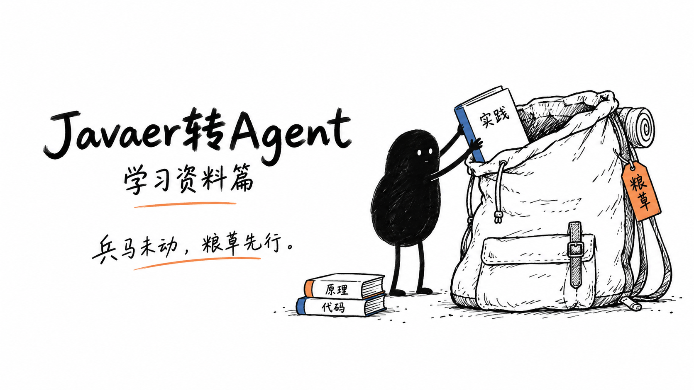
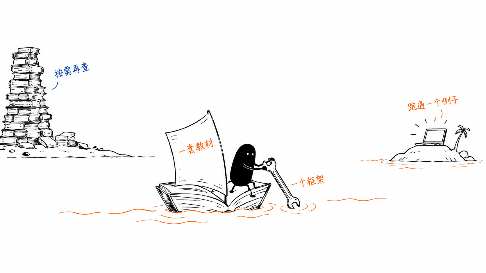
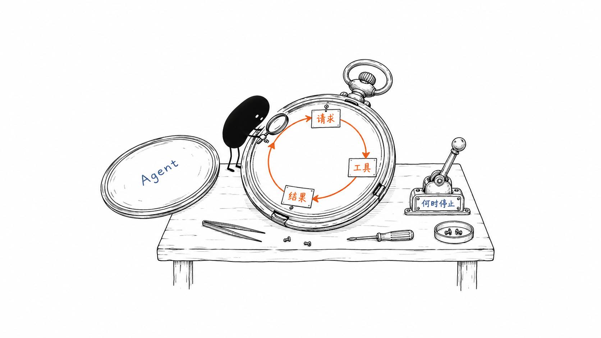

# Javaer转Agent：学习资料篇

兵马未动，粮草先行，学习资料便是粮草。

写惯了 Java 和 Spring，开始学 Agent，第一步往往卡在选资料上：教程里的例子多是 Python，框架一个接一个，Prompt、RAG、MCP、Skills 又常常出现在同一张学习路线图里。

这篇把资料按用途放在一起：入门读哪些教材，动手用哪些 Java 框架，遇到工程问题查哪些文章，想进一步理解实现又能看哪些开源项目。每份资料旁边都写了建议从哪里开始。

可以先定一个小目标：选一套教材、一个框架，做出一个能调用工具的例子。暂时用不到的资料，等问题出现了再回来查。

## 1. 从一个能运行的例子开始

先读概念，再看模型怎样调用工具、工具结果怎样交回模型。理解这段循环后，用 Java 写一个例子；接下来才有具体的问题可问：调用为什么失败，历史消息怎么处理，结果到底对不对。下面按这个顺序选资料。

| 阶段 | 优先资源 | 学完要能做什么 |
|---|---|---|
| 建立概念 | 程序员 Left、川处安文章；Hello-Agents | 区分模型调用、固定工作流和 Agent |
| 理解运行机制 | Learn Claude Code 的循环、工具、权限章节 | 画出模型请求、工具执行、结果回填与退出过程 |
| Java 动手 | Spring AI + 官方示例，或 LangChain4j + 官方示例 | 完成一个只读工具调用，记录失败和停止原因 |
| 工程补课 | Learn Agent Architecture、李博杰的书、AgentGuide、官方评测文章 | 为上下文、超时、权限、步数上限和结果正确性制定检查项 |
| 查漏自测 | sjzhang312/Agent、AIGC-Interview-Book | 先闭卷回答，再用文档和实验修正答案 |
| 项目研究 | DeerFlow、OpenHands、Browser Use 等 | 只追踪一条任务执行链，解释其设计取舍 |

熟悉 Spring 的话，可以先用 Spring AI；也可以选 LangChain4j。两条路线选一条就够了。遇到 Python 示例，先看输入、状态和返回值怎样流动，把机制弄清楚，再对照 Java 的写法。

### 跟练之前，先对一下版本

这里优先放近年的文章和持续维护的项目。跟练时，把教程、依赖和文档的版本对齐。视频里的方法找不到了，先看看自己装的是不是同一个版本。

想跟着做一遍，可以看视频；查参数和接口，打开官方文档；想知道某一步为什么这样执行，再去读源码。

## 2. 这几份教材，各有用处

先从 Hello-Agents 或卡码笔记建立概念，再用两个小型教学项目理解运行机制。问答和题库留到复习时用，读起来会更有收获。

| 资料 | 适合用来做什么 | 从哪里读起 | 阅读时留意 |
|---|---|---|---|
| [Hello-Agents](https://github.com/datawhalechina/Hello-Agents) · [在线教材](https://datawhalechina.github.io/hello-agents/#/) | 中文系统教材；主线 | 从智能体概念、经典范式开始，再读工具、记忆、评估相关章节 | 示例主要为 Python；先学机制，实践另选 Java 框架 |
| [卡码笔记：大模型应用开发学习路线](https://notes.kamacoder.com/llm/) | 中文应用开发专栏；入门与补课 | 先读入门认知、Prompt 与调用基础，再进入 Agent 章节；需要知识检索时补 RAG | 优先理解结构化输出、Function Calling、工具设计和评估；微调与 Transformer 原理按需后置 |
| [Learn Claude Code](https://github.com/shareAI-lab/learn-claude-code) | 小型 Harness 教学；主线辅助 | 当前根目录 s01～s17；先 s01 循环、s02 工具、s03 权限，再按需看 s08 上下文压缩、s09 记忆 | 社区教学实现，不是 Claude Code 官方源码；Python/Bash 示例不可直接搬成 Java API |
| [Learn Agent Architecture](https://github.com/hardness1020/learn-agent-architecture) · [中文入口](https://github.com/hardness1020/learn-agent-architecture/blob/main/README.zh-CN.md) | Agent 架构分层教程；基础到进阶 | 先读 0～3 节的 Harness、循环、工具和权限，再选读上下文、记忆、错误恢复与评估 | 配套示例为 Python；重点理解控制流，并对照 Java 中的工具分发、状态管理和异常处理 |
| [AgentGuide](https://github.com/adongwanai/AgentGuide) | 工程与求职导航；按需查询 | 选择开发方向，围绕工具、RAG、上下文、评测查主题 | 选应用开发相关内容；求职部分按自己的目标取舍 |
| [sjzhang312/Agent](https://github.com/sjzhang312/Agent) · [Agent.md](https://github.com/sjzhang312/Agent/blob/main/Agent.md) | 问答整理；自测 | 先尝试解释问题，再查答案；LangChain/LangGraph 目录作为扩展 | 用问答检查知识盲点，协议格式和技术结论结合官方资料理解 |
| [AIGC-Interview-Book](https://github.com/WeThinkIn/AIGC-Interview-Book) | 综合题库；复习 | README 的 AI Agent 基础、2026 AI Agent 岗面试 50 问、开发岗转 AI 应用工程师路线 | 范围含算法、视觉、训练等；只选与当前练习有关的问题 |
| [DeerFlow](https://github.com/bytedance/deer-flow) | 综合 Agent 应用；进阶 | 从 README 的核心能力进入：工具、Skills、子 Agent、沙箱、上下文和记忆 | 当前 2.0 为重写版，旧 Deep Research 在 1.x 分支；建立单 Agent 基础后再研究 |
| [深入理解 AI Agent：李博杰](https://github.com/bojieli/ai-agent-book) | 原理与工程书；长期参考 | 先按主题读上下文、工具、运行与评估，再选一个配套实验 | README 当前为 2.0；已有 PDF v1.0 的页码、章节号不能直接套用新版 |
| [《Agent 架构实操》：ryzqi/learn-agent](https://github.com/ryzqi/learn-agent) | 中文架构实操；TypeScript 配套代码 | 先读 Agent Loop、工具和权限，再读上下文压缩与记忆 | 用 Java 复现一个工具循环；多 Agent、Worktree 与 MCP 按需后置 |
| [agent_learning：从零学习 Agent 开发](https://github.com/Haozhe-Xing/agent_learning) | 中英双语系统教材；原理到工程 | 从工具、记忆、规划开始，再对照 reference-agent 阅读评测与安全实现 | 先学运行机制；框架、多 Agent 与 Agentic RL 按需选读 |
| [布吉岛 Agent：aiagentguide](https://github.com/itkdm/aiagentguide) | 中文开发指南；概念与选型 | 先区分 Agent、Chatbot、Workflow 和 RAG，再读工具调用与上下文管理 | 先完成一个最小案例，再按需求比较框架 |
| [ai-agents-from-zero：从零到实战](https://github.com/didilili/ai-agents-from-zero) | 学习路线、实战与面试题库 | 先看基础概念和工具调用；需要 Python 技术栈时再跟练 LangChain / LangGraph | Coze / Dify、部署与微调分支按需选，Java 主线可继续使用 Spring AI |
| [ModelScope 魔搭 Cookbook](https://modelscope.cn/active/ms-cookbook) | 魔搭社区 Cookbook 入口；专题补充 | 围绕当前练习查找资料，选一个案例阅读 | 跟练前核对模型、依赖版本与运行条件 |

读 **Learn Claude Code** 时，选根目录的 17 节主线。docs/、agents/ 中还留着旧版 12 节，章节号对不上，记笔记时顺手记下版本。第一轮看循环、工具和权限即可，练习时可以把 Bash 换成一个只读工具；后台任务、调度和多 Agent 留到后面。

**Learn Agent Architecture** 适合接着往下读。它会讲一个机制解决什么问题、不同系统怎样实现，以及哪里容易出错。有代码的章节，先看 src/loop.py，再读 demo.py，对比上一节多了什么。比如读错误处理时，就挑一次工具调用失败的情况，顺着代码找：错误怎么返回，要不要重试，什么时候停下来。最后用 Java 写一遍。

李博杰的书可以放在手边按主题查。**2.0 版的 Agent 评估在第七章**，如果手里还是 v1.0 PDF，按章节主题找会比照旧页码翻更方便。正文、PDF 和实验尽量用同一版。

**DeerFlow** 可以晚一点读。选一次“检索资料并生成报告”的任务，跟着它看输入去了哪里、谁调用工具、子任务把结果交给谁。能讲清这条过程之后，再决定要不要部署整套应用。

## 3. 想读源码，就挑一个感兴趣的项目

个人助手、浏览器操作、代码开发、可视化工作流，各有可以参考的项目。先挑一个自己想做的方向，读一个具体任务是怎么完成的。

| 项目 | 方向 | 先看什么 | 适合哪个阶段 |
|---|---|---|---|
| [OpenClaw](https://github.com/openclaw/openclaw) | 个人助手与多入口集成 | 从 README 进入会话与执行流程，画出消息如何到达 Agent | 进阶；先理解会话隔离，再接真实账号 |
| [Dify](https://github.com/langgenius/dify) | 可视化工作流、RAG、应用平台 | 搭一个小流程，区分固定节点与模型选择工具 | 可先体验产品；源码与部署研究后置 |
| [Browser Use](https://github.com/browser-use/browser-use) | 浏览器 Agent | 在测试网页完成“读取—选择动作—验证结果”，分析一次失败 | Python；先只读，避免以真实提交任务练手 |
| [OpenHands](https://github.com/OpenHands/OpenHands) | 软件开发 Agent | 从 README 的 Architecture overview 进入，追踪任务到执行反馈 | 进阶；用独立练习仓库理解运行环境 |
| [Google ADK Python](https://github.com/google/adk-python) | Agent、工作流、评测与部署 | 对照 Agent 与 Workflow 的责任，读一个最小工具示例 | Python 参考；2.0 与 1.x 教程需区分版本 |
| [Google ADK Java](https://github.com/google/adk-java) | Java Agent 开发 | 用熟悉的 Java 对照 Agent、工具、会话等概念 | Java 候选；不假设与 Python 版功能完全同步 |
| [Microsoft Agent Framework](https://github.com/microsoft/agent-framework) | Agent 与多 Agent 工作流 | 读最小 Agent 和状态隔离示例，再比较编排方式 | Python / .NET；作为设计参考，不是 Java 框架 |

如果想从小实现读到完整项目，可以按 **Learn Claude Code → mini-swe-agent → OpenHands 或 DeerFlow** 的顺序。偏向个人助手、可视化应用或浏览器操作，就分别看 OpenClaw、Dify、Browser Use。

### 第一遍源码，读到什么程度

先从 README 找到一个最小场景，记下 commit 或 tag。然后沿着“输入 → 模型请求 → 工具分发 → 结果回填 → 停止”读下去。

这一遍最好能回答几个问题：状态存在哪里，不同会话会不会串数据；工具出错以后怎么处理；步数、耗时和权限由谁限制。

接着用一个正常任务、一个失败任务试试自己的理解。只看过代码的地方，笔记里写明是推断；真正跑过的地方，留下输入和输出。挑其中一个机制，用 Java 写成小练习，就有了这次阅读的成果。

## 4. 时间不多时，先读这些文章

短文适合先理清概念，课程和书籍导读适合接着找资料。涉及具体 API、缓存方式或协议行为时，再回到对应实现的文档。

| 资料 | 日期 / 类型 | 读什么 |
|---|---|---|
| [程序员 Left：Agent 工程解析（零）](https://x.com/coder_left/status/2097253174260502592) | 2026-09-08 · 概念文章 | 入门看聊天、工作流、Agent 的区别；找出工具结果如何回填。伪代码不是跨厂商统一 API |
| [川处安：重新理解 AI Agent 的一切](https://shens.blog/posts/202609/agent-fundamentals/) · [X 入口](https://x.com/leoshen0/status/2099641267726758095) | 2026-09-15（X）· 原理导读 | 串联 Loop、上下文、工具与 Harness；全量历史、MCP 加载和缓存收益需区分实现 |
| [meng shao：CMU AI Agents](https://x.com/shao__meng/status/2097496946877636655) · [作业 1](https://github.com/cmu-agents/assignment-1/blob/main/ASSIGNMENT.md) | 2026-09-09 · 课程导读 | 进阶借鉴实现与验证方式；需要 Python，部分云端运行可能计费 |
| [meng shao：Harness 六层手册导读](https://x.com/shao__meng/status/2093228362965651665) | 2026-08-28 · 工程导读 | 用约束、验证、循环、记忆、权限、观察记录检查自己的练习 |
| [lumxss：Agentic Design Patterns 推荐](https://x.com/bkdgiffug/status/2097499479926767871) | 2026-09-09（帖子）· 书籍推荐 | 按需读工具、链式流程、路由与反思；2026 推荐不等于 2026 新书 |
| [小山学堂：AI 教我学习](https://xueai.miyang.cn/slides/learn.html#learn-1.html) | 学习方法 · 选读 learn-1、3、4、5、15 | 说明学习起点，一次解决一个问题；闭卷回答，再核对和变换条件 |

## 5. 动手开发，用这些 Java 框架和示例

写第一个例子时，直接把框架和它的官方示例放在一起看。下面也留了一些专题和其他语言的仓库，方便遇到问题时查。前面出现过的教材在这里保留入口，找起来更方便。

| 编号 | 仓库 | 语言 / 阶段 | 怎么用 |
|---|---|---|---|
| G01 | [Hello-Agents](https://github.com/datawhalechina/hello-agents) | 中文教材，示例以 Python 为主；入门 | 学概念，不要求先把 Python 环境全部搭完 |
| G03 | [AI Agents for Beginners](https://github.com/microsoft/ai-agents-for-beginners) | 通用原理 / Python；补充 | 用来对照工具、记忆与设计模式，避免与主教材重复刷 |
| G04 | [AgentGuide](https://github.com/adongwanai/AgentGuide) | 中文工程索引；中期 | 带着实际问题检索，不从算法和求职部分开始 |
| G05 | [sjzhang312/Agent](https://github.com/sjzhang312/Agent) | 中文问答 / Python；自测 | 解释完问题后再查答案，注意部分内容待补 |
| G06 | [spring-projects/spring-ai](https://github.com/spring-projects/spring-ai) | Java；默认实践路线 | 先模型与工具，之后记忆/RAG；版本看 Releases |
| G07 | [spring-ai-examples](https://github.com/spring-projects/spring-ai-examples) | Java；与 G06 配套 | 选最小示例，保留完整依赖组合，不混搭不同版本 |
| G08 | [awesome-spring-ai](https://github.com/spring-ai-community/awesome-spring-ai) | Java 生态导航；查漏 | 社区维护的索引；选中项目后再看文档、更新和示例 |
| G09 | [langchain4j](https://github.com/langchain4j/langchain4j) | Java；替代主线 | ChatModel → AiServices → Tools → ChatMemory |
| G10 | [langchain4j-examples](https://github.com/langchain4j/langchain4j-examples) | Java；与 G09 配套 | 和 B03 对照，先跑一个模型和一个只读工具 |
| G11 | [spring-ai-alibaba](https://github.com/alibaba/spring-ai-alibaba) | Java；主线完成后 | 再学 Agent/图编排，核对其 Spring AI 兼容版本 |
| G12 | [Spring AI Alibaba examples](https://github.com/spring-ai-alibaba/examples) | Java；与 G11 配套 | 从官方主仓库链接进入，选单 Agent 案例 |
| G13 | [agentscope-java](https://github.com/agentscope-ai/agentscope-java) | Java；进阶选一 | 比较循环、状态、工具与 Harness；不是 Python 同名包 |
| G14 | [langgraph4j](https://github.com/langgraph4j/langgraph4j) | Java；图编排 | 需要分支、状态与恢复时再学，按 Java API 写示例 |
| G15 | [MCP Java SDK](https://github.com/modelcontextprotocol/java-sdk) | Java；本地工具之后 | 把同一个只读能力接成 MCP，再验证权限和连接失败 |
| G16 | [spring-ai-agent-utils](https://github.com/spring-ai-community/spring-ai-agent-utils) | Java；工具扩展 | 带着工具需求阅读，涉及执行/写入能力时审查边界 |
| G17 | [All-in-RAG](https://github.com/datawhalechina/all-in-rag) | 中文 / Python；检索专题 | 从加载、分块、检索、生成逐层定位错误 |
| G18 | [Hugging Face Agents Course](https://github.com/huggingface/agents-course) | 英文 / Python；拓展 | 具备 Python 和模型调用基础后选一个任务复现 |
| G19 | [Learn Claude Code](https://github.com/shareAI-lab/learn-claude-code) | Python / Harness；进阶 | 按小节跟踪工具循环；是社区教学项目，不是产品官方源码 |
| G20 | [Pi](https://github.com/earendil-works/pi) | TypeScript；源码研究 | 对照 Loop、Session、压缩等职责，不必先学整个生态 |
| G21 | [mini-swe-agent](https://github.com/SWE-agent/mini-swe-agent) | Python；代码 Agent | 先读循环和评测；能执行命令，不作为小白第一份运行示例 |
| G22 | [LangGraph](https://github.com/langchain-ai/langgraph) | Python / JS；可选分支 | 有状态编排需求时再迁移，同名概念不等于 Java API |
| G23 | [LangChain Academy](https://github.com/langchain-ai/langchain-academy) | Python；配套学习 | 完成 Java 主线以后再选，不把多语言当入门门槛 |
| G24 | [Anthropic courses](https://github.com/anthropics/courses) | 英文；模型调用专题 | 选提示与工具相关内容，注意厂商协议差异 |
| G25 | [Prompt engineering tutorial](https://github.com/anthropics/prompt-eng-interactive-tutorial) | 英文；按需补课 | 用清楚的输入输出契约替代堆砌角色提示词 |
| G26 | [Anthropic skills](https://github.com/anthropics/skills) | 说明与脚本；后期 | 阅读结构和触发条件，安装前看包含哪些代码 |
| G27 | [Ollama](https://github.com/ollama/ollama) | 本地模型工具；可选 | 有合适现成硬件再试；模型是否支持工具调用须单独确认 |

## 6. 碰到工程问题，回官方资料查

工具能调通以后，还会遇到任务做不完、结果不稳定、上下文越来越长等问题。下面的工程文章适合这时读，框架文档则可以在写代码时随时查。

| 编号 | 资料 / 时间 | 读什么 |
|---|---|---|
| D01 | [Demystifying evals for AI agents](https://www.anthropic.com/engineering/demystifying-evals-for-ai-agents) · 2026-01-09 | 区分任务、运行轨迹、评分；为自己的项目写可检查的通过条件 |
| D02 | [Harness design for long-running application development](https://www.anthropic.com/engineering/harness-design-long-running-apps) · 2026-03-24 | 完成基础练习后研究任务拆分、上下文交接和独立评价；不照搬其多 Agent 规模与成本 |
| D03 | [Scaling Managed Agents](https://www.anthropic.com/engineering/managed-agents) · 2026-04-08 | 进阶理解模型决策与执行环境的拆分 |
| D04 | [Spring AI Getting Started](https://docs.spring.io/spring-ai/reference/getting-started.html) / [Tools](https://docs.spring.io/spring-ai/reference/api/tools.html) · 现行文档 | 以版本兼容要求和真实工具 API 为准 |
| D05 | [LangChain4j Get Started](https://docs.langchain4j.dev/get-started/) / [Tools](https://docs.langchain4j.dev/tutorials/tools/) · 现行文档 | 和 B03 的版本对照；不把视频旧签名当现行 API |
| D06 | [MCP 官方介绍](https://modelcontextprotocol.io/docs/getting-started/intro) · 现行文档 | 认识协议解决的问题，再看 Java SDK |
| D07 | [OpenAI Building agents](https://developers.openai.com/tracks/building-agents) · 现行文档 | 对照模型、工具、状态与编排；具体字段按所用服务的文档理解 |

## 7. 喜欢跟着做，可以选这些 B 站课程

下面优先列出 2026 年发布的视频，最后一项是按主题选看的补充合集。Spring AI 和 LangChain4j 先选一条路线，重复的基础内容可以跳过。

| 编号 | 资料 / 发布日期 | 作者 / 课程规模 | 建议看哪些部分 |
|---|---|---|---|
| B01 | [小白 AI Agent 学习指南](https://www.bilibili.com/video/BV1fj426wEHD/) · 2026-08-29 | AI_Julie | 09:04 的路线预览，适合开始前看 |
| B02 | [Spring AI 2.0：代码助手与工具调用课程](https://www.bilibili.com/video/BV1cBgG6wEpD) · 2026-08-12 | 图灵学院诸葛；19 节 | Spring 路线视频辅助：先 2～7 节的环境、对话、流式、记忆、压缩、工具；源码读写和 GitHub MCP 留到后面 |
| B03 | [小白系列：LangChain4j 从入门到精通](https://www.bilibili.com/video/BV1DDMt6HEA7/) · 2026-07-07 | 动力节点；70 节 | Java 替代主线：2～6、8～13、28～33、40～51；介绍标称 1.14+，跟练锁定其示例版本 |
| B04 | [Java AI Agent、Spring AI Alibaba 与 Skill](https://www.bilibili.com/video/BV1PMEQ6eEhX/) · 2026-06-10 | 92 节；选看技术章节 | 完成基础后选看 Agent/Workflow、拦截和消息压缩 |
| B05 | [AgentScope 2.x：Java 意图路由与多 MCP 实战](https://www.bilibili.com/video/BV1LHgC65Era/) · 2026-07-22 | 意图路由与多 MCP 专题 | 进阶比较路由、会话状态和工具挂载；描述包含权限 BYPASS，学习时须自行保持执行权限限制 |
| B06 | [AgentScope Java 2.0 核心组件篇](https://www.bilibili.com/video/BV185ED66EB1/) · 2026-06-10 | 都叫我大帅哥；25 节 | Java 进阶：先 1～6 的单 Agent，再 7～8 的会话/中断、12～18 的权限/工具异常；MCP/Skill 后置 |
| B07 | [《浅入深出》Agent 系列](https://space.bilibili.com/70890833/favlist?fid=8371703&ftype=collect&ctype=21) · 专题补充 | 奇创喵；18 个视频 | 先看 Agent、Tools/MCP、ReAct 与 Harness，再按需补 RAG、记忆和评测；多 Agent 与服务化后置 |

选 **B03 的 LangChain4j 课程**，可以先做单模型、内存会话和只读工具，再看记忆隔离、工具异常与并发。MySQL、Redis、MQ 和业务登记项目放到后面，先把模型与工具的交互弄明白。

选 **B02 的 Spring AI 课程**，可以一边看视频，一边对照官方示例。练到外部仓库读写时，先换成返回固定学习资料的只读工具，同样能练习工具调用。

部分视频课件需要私信或站外领取。想直接动手，可以使用第 5 节列出的官方 GitHub 示例。

### 其他视频入口

- [Hello-Agents 官方视频共创导航](https://github.com/datawhalechina/hello-agents/blob/main/Extra-Chapter/Extra13-Hello-Agents视频课录制共创.md)：按章节寻找配套讲解，视频更新情况以导航页为准。
- [LangChain 视频](https://www.bilibili.com/video/BV1cCd6YwE4n/) 与 [LangGraph 视频](https://www.bilibili.com/video/BV1nPMbzQELz/)：来自 sjzhang312 仓库的推荐，适合准备补充 Python 技术栈的读者选看。

## 8. 再往下读，去翻教程的 References

教程里的某个机制让你感兴趣，就翻到章末看看它引用了什么。[Learn Agent Architecture 的 References](https://github.com/hardness1020/learn-agent-architecture#references) 和各章 Sources 提供了原始文档、论文和实现，适合接着查设计依据。

下面按问题分了几组，也放进了同作者的配套教程。前面已有的 Learn Claude Code、mini-swe-agent 和李博杰的书，可以一起对照着读。

### 8.1 循环与编排：哪些交给模型，哪些写进代码

| 资料 | 适合什么时候读 | 带着什么问题读 |
|---|---|---|
| [LangChain：The Art of Loop Engineering](https://www.langchain.com/blog/the-art-of-loop-engineering) | 已经理解工具循环之后 | 执行、验证、事件触发和改进分别解决什么问题？哪些循环需要独立的停止条件？ |
| [LangChain：3 Years of Graph Engineering with LangGraph](https://www.langchain.com/blog/3-years-of-graph-engineering-with-langgraph) | 流程开始出现分支与回退时 | 节点、边和状态如何约束执行路径？什么时候一个简单循环就够用？ |
| [Google：Why we built ADK 2.0](https://developers.googleblog.com/en/why-we-built-adk-20/) | 比较 Agent 与固定工作流时 | 哪些步骤适合用普通代码，哪些需要模型判断？不同节点如何隔离上下文？ |
| [Lilian Weng：Harness Engineering for Self-Improvement](https://lilianweng.github.io/posts/2026-07-04-harness/) · 2026 | 能运行并评测一个 Agent 之后 | 系统可以改什么、用什么判断改进、怎样避免越改越差？ |

读完后，拿“检索资料 → 生成回答 → 检查引用”试着画一遍：哪些步骤能写成固定代码，哪些需要模型判断？分清以后，再选普通方法调用、状态机或图编排。文中的 Python 示例可以帮助理解分工，动手时换成自己所用 Java 框架的接口。

### 8.2 Skills、上下文与权限：让工具用得合适

| 资料 | 阅读重点 | 可以做的小练习 |
|---|---|---|
| [Agent Skills 标准](https://agentskills.io/) | Skill 的目录结构，以及说明、脚本和资源如何组织 | 把一个已有任务整理成 Skill，写清适用场景和所需文件 |
| [Anthropic：Skill authoring best practices](https://platform.claude.com/docs/en/agents-and-tools/agent-skills/best-practices) | 简洁描述、按需加载、用实际任务验证效果 | 比较“全部内容一次加载”和“按任务读取”的上下文差异 |
| [Anthropic：Prompt caching](https://platform.claude.com/docs/en/build-with-claude/prompt-caching) | 稳定前缀、缓存边界和命中条件 | 区分固定说明与动态消息，观察修改不同位置后的缓存统计 |
| [Simon Willison：The lethal trifecta for AI agents](https://simonwillison.net/2025/Jun/16/the-lethal-trifecta/) · 2025 | 私有数据、不可信内容与对外通信叠加时的风险 | 给资料助手列出可读目录、可调用工具和允许访问的外部地址 |

写 Skill 时，把操作说明写清楚；执行工具时，参数、文件路径和权限仍由程序检查。读缓存文档时，留意自己用的是哪家模型服务，它们的字段和计费规则可能不同。

### 8.3 记忆与运行框架：选一个实现拆开看

| 项目 | 学什么 | 建议起点 |
|---|---|---|
| [Hermes Agent](https://github.com/NousResearch/hermes-agent) | 长期助手中的记忆、Skills、会话与调度 | 先追踪一次记忆写入和后续读取，再看它如何进入下一轮上下文 |
| [DeepSeek Harness](https://github.com/deepseek-ai/deepseek-harness) | 用插件组织 Agent 的运行能力 | 从架构文档进入，选循环、工具或会话中的一个模块阅读 |
| [Learn Agent Memory](https://github.com/hardness1020/learn-agent-memory) | 分阶段构建记忆系统的配套教程 | 接着架构教程的 Memory 章节，逐步理解存储、召回和整理 |
| [Learn DeepSeek Harness](https://github.com/hardness1020/learn-deepseek-harness) | DeepSeek Harness 的配套学习项目 | 先读一个机制及其示例，再回官方仓库对照实现 |
| [OpenViking](https://github.com/volcengine/OpenViking) | 统一组织记忆、知识与 Skills 的上下文数据库 | 对照文件与目录式组织方式，思考资料如何定位、摘要如何生成 |

可以先试一个小场景：用户换了会话，哪些信息还需要记住，哪些应该清掉？用少量本地数据写出隔离、召回和更新逻辑，确认符合预期，再考虑独立的存储服务。

### 8.4 评测与可观测性：知道它为什么成功或失败

| 资料 | 学习重点 | Javaer 可以怎么用 |
|---|---|---|
| [EvalGrill](https://github.com/hardness1020/EvalGrill) | 从真实 Agent 失败案例构建、验证评测任务 | 把一个失败输入整理成可重复执行的用例，写清预期结果与判定依据 |
| [OpenTelemetry Tracing API](https://opentelemetry.io/docs/specs/otel/trace/api/) | Span、父子关系、耗时、状态和属性 | 将一次用户任务关联到模型请求和工具调用，查看耗时与错误发生在哪一步 |
| [OpenInference](https://github.com/Arize-ai/openinference) | AI 可观测性的语义约定与埋点实现 | 参考模型、工具等调用的记录方式；具体接入方式按 Java 技术栈选择 |
| [A2A 协议](https://github.com/a2aproject/A2A) | 独立 Agent 应用之间的发现、任务状态与结果交换 | 有跨服务协作需求时，再研究任务生命周期和失败处理 |

评测可以从第 6 节的 D01 读起，再看 EvalGrill 怎样整理失败案例。调用轨迹能告诉你哪一步出了问题，任务是否完成则要靠事先写好的标准判断。等多个独立应用需要通信时，再看 A2A。

这一部分按需查即可。先把工具循环、上下文和权限处理好，留下一组评测用例和能定位问题的调用轨迹，再往长期记忆、多 Agent 编排扩展。

## 9. 看完一段，就做一点

开始时，一篇概念文章、Hello-Agents 的基础章节和一个 Java 官方示例就够用了。给例子加上只读工具，再写几道题检查结果。等这个小程序能解释清楚了，再挑一个开源项目继续读。

每读完一小段，顺手记下这些内容，下一次就知道从哪里接着学：

| 记录项 | 要写什么 |
|---|---|
| 来源 | 资源名称、链接、学习日期 |
| 版本 | 所读章节、代码 commit/tag、JDK、框架版本 |
| 问题 | 这次要解决什么；目前卡在哪里 |
| 证据 | 目录、正文、源码阅读或实际运行，明确区分 |
| 实验 | 输入、预期结果、失败条件、实际结果 |
| 复盘 | 闭卷解释执行过程；仍不确定什么 |

最后合上资料，试着讲清三件事：为什么需要工具循环？模型选错工具时由谁拦截？怎么判断任务已经完成？哪一处讲不清，就回到代码里跑一次，看看实际发生了什么。

### **持续更新中，看到好的资料和项目都会更新！！！**

**也可在文章顶部的「资料导航」tab进行速览查看😃**

**！！！敬请关注！！！**

## 更新记录

### 2026-09-18｜补充实操教程，精简资料清单

- **新增 5 项资料**：《Agent 架构实操》（ryzqi/learn-agent）、agent_learning、布吉岛 Agent（aiagentguide）、ai-agents-from-zero、ModelScope 魔搭 Cookbook。已补充各自的学习用途、阅读起点和 Javaer 跟练建议。
- **移除 9 项资料入口**：CMU AI Agents 课程站、Agentic Design Patterns 仓库及出版社书目、Generative AI for Beginners Java、Lost in the Middle、MCP-Zero、τ²-Bench、Why Do Multi-Agent LLM Systems Fail?、Building effective agents。其余未涉及的推荐推文与作业入口保留。
- **同步正文与资料导航**：清理移除条目对应的说明和论文选读小节，导航现收录 91 个链接。

### 2026-09-17｜上线资料导航

- 文章新增“正文 / 资料导航”Tab，可在阅读文章和查找资料之间切换。
- 资料导航支持分类筛选、关键词搜索、展开更多和复制链接；同一资料的部分阅读入口合并展示。
- 默认展示入门精选，方便先选一套教材和一个 Java 框架开始练习。
