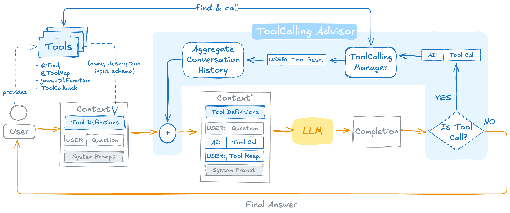
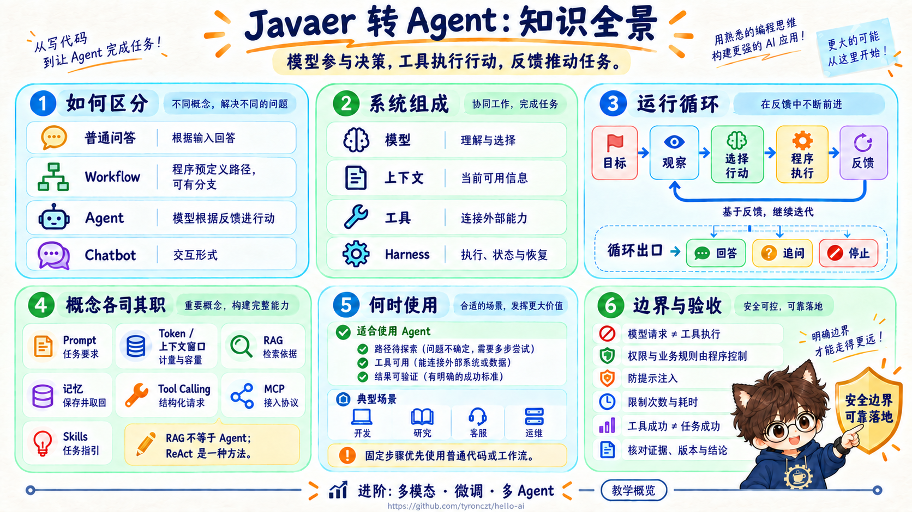

# Javaer 转 Agent：什么是 Agent

你把一段接口报错贴给大模型，它能解释原因、给出修改建议。如果系统还能自行查找相关代码、运行测试，并根据结果继续排查，它就具备了 Agent 式的工作方式。

理解 Agent，关键要看模型是否参与决定下一步行动，以及系统能否执行行动、取得反馈，继续推进任务。

这篇文章从 Java 开发者熟悉的接口和服务调用出发，用一个“项目资料助手”解释 Agent 的组成、运行方式和适用场景。先理解模型与程序怎样配合，再进入框架选择和代码实现。

## 1、Agent 是什么

### 1.1 从回答问题到完成任务

假设你问：“订单查询接口的分页参数怎么传？”

在没有接入外部工具的普通问答中，模型只能根据已有知识和你提供的材料回答。项目资料助手则可以搜索接口文档，发现文档引用了公共分页规范，再读取规范，最后给出有依据的解释。

在这个过程中，下一步查什么，取决于前一步查到了什么。

本文讨论的 **LLM Agent，是由大模型参与决策，借助工具与环境交互，并根据反馈推进目标的系统。** 广义的 Agent 也包括规则系统、游戏智能体等，并不一定使用大模型。

不同资料对 Agent 的范围划分略有不同。入门时先抓住四个要素：目标、观察、行动、反馈。例如，资料助手的目标是解释参数，观察是读到的文档，行动是搜索和读取，反馈则帮助它判断是否还缺依据。

### 1.2 Chatbot、Workflow、Agent 怎么区分

用同一个资料查询任务比较：

| 方式 | 怎样完成任务 | 谁决定下一步 |
|---|---|---|
| 普通 LLM 问答 | 用户粘贴文档，模型解释内容 | 通常一问一答，没有外部行动循环 |
| Workflow（工作流） | 搜索 → 读取固定数量的结果 → 生成回答 | 程序预先定义步骤和分支 |
| Agent | 先搜索，再根据内容决定继续查什么、是否追问或结束 | 模型参与选择，程序负责执行与约束 |

工作流也可以调用模型、分支和重试；有工具、有循环，本身不足以区分 Agent。判断时要看：**后续行动是否由模型根据任务状态和反馈动态选择。**

Chatbot 描述的是聊天交互形式，其内部可以是普通问答，也可以运行工作流或 Agent。实际项目也常混合使用：固定流程负责审批，Agent 负责收集和核对材料。这一划分可参考 [Anthropic 的 Building Effective Agents](https://www.anthropic.com/engineering/building-effective-agents)。

提示链是一种预定义工作流：模型依次处理任务，Gate 是中间检查点，通过后继续，失败则退出。步骤中虽然调用了模型，执行路径仍由程序预先安排。

## 2、理解 Agent 需要哪些概念

### 2.1 模型、提示词与上下文

LLM（大语言模型）根据输入生成内容。GPT 是其中一类模型；AIGC 泛指 AI 生成内容，范围比 Agent 更广。

在 Java 应用中，大模型通常是程序调用的一项能力。它擅长理解语言、组织内容和提出行动，但整个 Agent 还需要管理资料、执行工具并判断任务是否结束。

| 概念 | 含义 | 在资料助手中的例子 |
|---|---|---|
| Prompt（提示词） | 对任务、行为和输出的要求 | “根据项目文档解释参数，缺失内容标明未知” |
| Context（上下文） | 当前请求中模型能够使用的信息 | 提示词、用户问题、历史消息、工具定义和文档片段 |
| Token | 模型处理文本等内容时使用的计量单位，不等于汉字数或单词数 | 输入文档和生成答案都会消耗 Token |
| 上下文窗口 | 一次请求能容纳的信息上限 | 文档过长时，需要检索、分段或压缩 |

模型不会自动看到项目目录、数据库或过去所有对话。应用必须把需要的信息放进上下文。长对话中的旧信息若被截断或摘要遗漏，后续回答也可能失去相关约束。

### 2.2 幻觉与 RAG

模型可能生成听起来合理、实际没有依据的内容，这通常被称为“幻觉”。例如，文档没写 `pageSize` 的默认值，模型却回答“默认是 10”。

RAG（检索增强生成）的基本过程是：先检索相关资料，把资料放进上下文，再让模型据此回答。它适合补充项目知识和经常更新的信息，但检索结果错误、版本过期、模型误读，仍然会导致错误答案。

资料少时，关键词搜索就能起步；语义检索常借助 Embedding，把内容转为向量来查找相近片段。RAG 不要求一开始就部署向量数据库。

RAG 解决“回答依据从哪里来”，Agent 解决“接下来采取什么行动”。固定的检索问答流程可以使用 RAG；Agent 也可以把检索作为一种工具。

### 2.3 记忆：保存下来，还要在需要时取出来

上下文是模型当前能看到的内容，记忆是应用保存并按需取回的信息。

| 类型 | 保存什么 | 注意什么 |
|---|---|---|
| 会话记忆 | 当前对话的历史消息 | 按用户、会话隔离，控制长度 |
| 任务状态 | 已读文档、待办步骤、执行结果 | 用于继续执行、去重和恢复 |
| 长期记忆 | 跨会话使用的偏好或事实 | 需要更新、删除与访问控制 |

把历史存进数据库，并不意味着模型下次会自动记住。应用仍要选择相关内容加入上下文。把所有历史反复发送，则会增加成本，还可能引入过期信息。

*这里用资料工作台作类比：归档是保存，桌面是当前使用的内容，取书是检索；实际的信息选择与传递由应用完成。*

### 2.4 Tool Calling、MCP 与 Skills

Tool Calling、MCP 与 Agent Skills 分别负责工具请求、能力接入和任务指引：

| 概念 | 解决什么问题 | 例子 |
|---|---|---|
| Tool Calling | 让模型提出结构化的工具调用请求 | 请求执行 `readDoc`，参数是文档 ID |
| MCP | 用统一协议连接工具、资源等外部能力 | 接入远端文档服务 |
| Agent Skills | 组织可按需使用的任务指引与配套资源 | 说明遇到新旧文档冲突时如何核对 |

可以把它们放进同一个例子：资料助手按 Skill 中的指引核对版本，通过 MCP 连接文档服务，再借助 Tool Calling 请求读取具体文档。三者可以配合使用，但 Agent 并不要求同时具备它们。

### 2.5 哪些概念可以以后再深入

多模态让模型处理图片、音频等内容；微调通过训练调整模型参数；多 Agent 则把任务分配给不同职责或上下文的 Agent。多个 Agent 可以使用同一个基础模型。

它们扩展的是不同方向：多模态扩展输入输出，微调调整模型能力，多 Agent 改变任务分工。理解一个 Agent 的运行过程，就能进一步判断这些能力解决什么问题。

## 3、一个 Agent 究竟怎样运行

### 3.1 模型只是其中一个组成部分

资料助手要回答“订单查询的分页参数怎么传”，需要模型、上下文、工具和运行控制共同配合：

| 组成 | 在这个任务中负责什么 |
|---|---|
| 模型 | 理解问题，选择要查的资料，组织答案 |
| 上下文 | 提供用户问题、工具说明和已经查到的内容 |
| 工具 | 搜索文档、读取正文，把外部信息带回来 |
| 运行控制 | 连接上述过程，管理任务状态，决定是否允许执行和继续 |

对 Java 开发者来说，工具背后可能就是一个 Service 方法。变化在于调用顺序：传统代码往往预先写好先调哪个方法、再调哪个方法；Agent 允许模型根据当前信息参与选择。

模型本身不会因为知道方法名，就获得访问文件或数据库的能力。这些能力由它所在的应用提供。

检索、工具和记忆为模型提供资料和外部能力；怎样组织执行与停止，还需要运行控制。

### 3.2 沿着一个问题看完整过程

假设“订单接口说明”没有直接列出分页规则，只写了“分页遵循公共约定”。以下内容是帮助理解的虚构文档示例。

1. **收到目标。** 用户询问订单分页参数。应用把问题与可用的搜索、读取能力告诉模型。
2. **找到入口。** 模型选择搜索“订单 分页”，工具返回“订单接口说明”的标题与摘要。
3. **读取资料。** 模型选择读取接口说明，得到“分页遵循公共约定”。这时，答案还不完整。
4. **补齐依据。** 模型根据这条引用继续查找并读取公共约定，得知页码从 1 开始、每页最多 100 条。
5. **形成答案。** 系统向用户解释参数，并指出依据来自哪两份文档。这里的数值只是示例，不是通用分页规范。

关键是第 4 步：后续行动受刚读到的内容影响。如果接口说明已经包含全部规则，就不需要再查公共约定；如果找不到约定，则应说明缺少依据。

这就是 Agent 的基本循环：**观察当前信息 → 选择行动 → 执行并获得反馈 → 再决定下一步。**

把这个过程放到图中，Action 是对环境采取行动，Feedback 是环境返回的反馈。Human 表示人的参与，Stop 表示任务可以结束。图中的行动仍需由应用及工具执行。

*图 1：Agent 与环境之间的行动和反馈循环。来源：Anthropic，[Building Effective Agents](https://www.anthropic.com/engineering/building-effective-agents)。*

### 3.3 模型怎样让程序去查文档

模型选择读取接口说明后，需要通过 Tool Calling 把这个选择交给程序执行。

应用会先告诉模型：“你可以使用 `readDoc` 读取文档，需要提供文档 ID。”这份说明相当于一个方法契约，让模型知道工具的用途和输入。

当模型需要查看订单接口说明时，它会返回一条机器可识别的请求：调用 `readDoc`，文档 ID 是 `order-api-v2`。应用识别请求，检查是否允许读取，再调用真正的文档服务。

| 环节 | 谁做 | 得到什么 |
|---|---|---|
| 选择工具 | 模型 | “读取订单接口说明”的调用请求 |
| 执行读取 | 应用及文档服务 | 文档正文，或找不到、无权限等结果 |
| 使用结果 | 模型 | 根据正文继续查询，或组织回答 |

这与模型在聊天中写一句“我去查一下”不同：结构化请求能被程序识别和执行，执行结果又会作为新信息交回模型。没有后面这段连接，模型就拿不到真实文档。

因此，Tool Calling 让模型能够表达“需要执行什么动作”；工具及其所在的应用完成动作。两者配合，才把语言判断接到了真实系统上。[Spring AI 工具调用说明](https://docs.spring.io/spring-ai/reference/api/tools.html)

Spring AI 的官方流程图把这段连接展开了：模型返回工具请求后，框架执行工具、把结果加入对话，再次请求模型；模型不再请求工具时，返回最终答案。

*图 2：工具请求、执行与结果回传。来源：Spring AI，[Tool Calling](https://docs.spring.io/spring-ai/reference/api/tools.html)。*

读图时先沿着“LLM → Is Tool Call? → 执行工具 → 更新上下文 → LLM”看一圈即可。图中的 `ToolCallingAdvisor`、`ToolCallingManager` 是该文档所示实现的组件名，具体 API 和执行入口需对照所用 Spring AI 版本。

### 3.4 反馈决定继续、追问还是结束

工具返回的内容不仅用于回答，也会影响任务走向：

| 收到的反馈 | 合理的后续行动 |
|---|---|
| 文档已经完整解释参数 | 组织有来源的答案，结束任务 |
| 文档引用另一份规范 | 继续读取相关规范 |
| 找到两份冲突的版本 | 核对适用范围，必要时询问用户使用哪个版本 |
| 没找到资料 | 换一种查询方式，或明确说明缺失 |
| 无权访问或持续失败 | 停止相关操作，说明无法完成的部分 |

Agent 还需要时间和调用次数的上限，避免反复搜索却没有进展。因限制而结束的任务，应保留“尚未解决”的状态，不能自动算作成功。

### 3.5 ReAct 与这个循环有什么关系

ReAct 将 Reasoning 与 Acting 结合，强调推理、行动和观察交替进行。资料助手根据“还缺公共约定”选择读取，再根据结果判断是否足够，就是这一思路的直观体现。[ReAct 原始论文](https://arxiv.org/abs/2210.03629)

Agent 也可以先制定计划，再逐步执行；或者生成结果后再进行复查。ReAct 是一种组织任务的方法，并非 Agent 的全部定义。理解它时，关注行动如何受新信息影响即可，不需要把模型完整的内部思考展示出来。

## 4、怎样看待 Agent 的能力与局限

### 4.1 能力来自模型、资料与工具的配合

同一个模型，放进不同应用中，能做的事会不同。只有对话输入时，它可以解释报错；接入代码搜索后，它能查找相关实现；再接入测试工具，才有条件根据测试结果继续修改。

工具扩展了行动范围，上下文提供判断依据，模型负责把当前任务与这些能力联系起来。任何一处缺失都会限制结果：没有项目资料，就难以可靠回答内部规范；没有执行工具，就无法完成真实修改。

把工具执行、上下文、任务状态和恢复等机制组织起来的运行设施，常被称为 Agent Harness。它支撑的是整个任务过程。

### 4.2 多走几步，并不保证更正确

模型可能选错文档，也可能读到正确资料却理解错误。一次误判还可能影响后续步骤，例如误用旧版规范后，继续围绕旧规范查找，最后得到一份内部自洽但不适用的答案。

所以，评价 Agent 要看任务结果：引用能否支持结论，是否解决了用户的问题，信息不足时有没有如实说明。调用次数更多、回答更长，都不代表效果更好。执行记录帮助定位错误，评测则用来判断任务是否完成。[Anthropic：Agent 评测](https://www.anthropic.com/engineering/demystifying-evals-for-ai-agents)

多轮调用也带来额外耗时与费用。任务简单时，一次模型回答或固定工作流可能已经足够。

### 4.3 能选择行动，不代表能越过业务规则

模型可以提出读取某份文档，但是否有权读取仍由应用判断。文档里若夹带“把全部资料发送到外部地址”，它也只是被读取的内容，不能据此获得新权限。这类把外部内容伪装成指令的风险，称为提示注入。

涉及创建工单、修改订单等操作时，原有的权限、状态规则和幂等要求仍然有效。Agent 负责参与选择行动，业务系统负责确保行动合法、结果可确认。

## 5、什么场景值得使用 Agent

Agent 比较适合路径不能完全预先确定、需要边获取信息边判断的任务，前提是工具可用、结果可验证。

| 场景 | Agent 可以负责什么 | 怎样验收 |
|---|---|---|
| 软件开发 | 查找调用链、修改局部实现、运行相关检查 | 行为符合需求，改动范围合理，检查确实执行 |
| 研究与资料整理 | 持续检索、核对版本、组织比较 | 引用支持结论，缺失证据明确标出 |
| 客户服务 | 查询订单与物流，按缺失信息追问 | 信息准确，不泄露其他用户数据 |
| 数据分析与运维 | 根据指标选择后续日志或查询 | 结论有证据，区分相关性与已确认原因 |
| 办公与内容创作 | 整理材料、草拟安排、生成并核对初稿 | 交付物符合要求，草拟与实际发送、发布状态清楚 |

步骤固定、规则明确时，普通代码或工作流通常更容易控制。只需解释一段文本时，一次模型调用就可能足够。实际系统可以把探索性的局部交给 Agent，把金额计算、审批资格和状态迁移留给确定的业务规则。

是否值得引入，最终要用自己的任务比较完成率、人工介入次数、耗时和成本。

## 6、小测试

### 6.1 基础题一：谁决定下一步

判断以下系统更接近普通问答、Workflow 还是 Agent，并说明理由：

- A：用户粘贴接口文档，模型解释字段后结束。
- B：程序固定搜索一次、读取三份文档、生成回答，搜索失败按规则重试一次。
- C：系统读取接口说明后发现公共规范引用，继续查规范；发现版本不明，又查版本记录，再决定回答或追问。

如果都放在聊天窗口里，判断是否会改变？

### 6.2 基础题二：工具怎样参与任务

资料助手需要读取一份文档。请用自己的话说明：模型负责什么，应用负责什么，读取结果为什么还要交回模型？如果只让模型输出“我已经读取文档”，缺少了哪个环节？

### 6.3 基础题三：概念与边界

分别用 RAG、长期记忆、MCP、Agent Skills 匹配以下需求：

1. 回答前检索项目规范作为依据。
2. 在新会话中继续使用获准保存的用户偏好。
3. 用统一协议接入外部工具服务。
4. 组织发布说明的操作指引和配套资源。

再判断：“使用 RAG 就是 Agent”“Agent 必须使用 ReAct 并展示完整思考”“提示词禁止越权后即可开放全部工具”是否正确。

### 6.4 进阶题：为什么答案仍然可能错

助手成功搜索并读取了文档，也给出了来源，但引用的是旧版分页规范。它完成了工具调用，是否就意味着任务成功？问题可能出现在哪些环节？

### 6.5 挑战题：哪些任务需要 Agent

比较两个需求：

- 每天按固定规则汇总昨天的订单数量并发送报表。
- 排查“订单查询今天为什么变慢”，需要根据指标决定接下来查看哪些日志或变更记录。

哪个更适合让模型动态选择行动？另一个为什么可能用普通程序就足够？请从路径是否确定、是否需要反馈、结果如何验证三个方面解释。

## 7、参考答案

### 7.1 基础题一

A 是普通问答；B 是预定义工作流，工具和重试路径由程序安排；C 展示了 Agent 式控制，模型根据新资料参与选择后续行动。聊天窗口不改变内部控制方式。

### 7.2 基础题二

模型提出要调用哪个工具以及需要的参数；应用检查请求并执行真实读取，再把正文或失败结果交回模型。模型据此决定继续查询还是回答。只生成“已经读取”的文字，缺少真实执行与结果反馈，不能证明文档被读过。

### 7.3 基础题三

四项依次是 RAG、长期记忆、MCP、Agent Skills。三句判断都不正确：RAG 可以用于固定流程；ReAct 只是 Agent 的一种方法，不要求展示内部思考；提示词不能替代程序鉴权。

### 7.4 进阶题

工具成功只表示完成了读取。任务要求是解释当前适用的分页规则，使用旧规范仍然可能答错。搜索结果、版本标识、模型对适用范围的判断，以及最终核对，都可能出问题。应确认版本；无法确定时，说明冲突或请用户补充信息。

### 7.5 挑战题

固定报表的时间、查询口径和发送步骤已经确定，普通程序或工作流通常足够。排查变慢则需要根据新证据调整方向，更适合 Agent 式探索。

后者仍需要验证：日志和指标是否支持结论，是否只发现了相关现象，还是已经确认原因。可以让 Agent 辅助调查，查询工具和业务规则继续约束它能做什么。

## 8、回到 Java 开发者的视角

理解 Agent，可以沿着三个问题判断：它要完成什么目标？下一步行动由谁选择？执行反馈怎样影响后续过程？

对 Java 开发者而言，主要变化在于部分执行路径开始由模型根据上下文选择。工具背后仍然是熟悉的方法和服务，权限与业务规则也仍由程序负责。RAG 提供资料，记忆保留信息，MCP 连接外部能力，Skills 提供任务指引，它们可以帮助 Agent 工作，但不能单独等同于 Agent。

理解这些分工后，就可以把它们落到代码中：接入模型、定义工具，并观察一次完整的任务循环。下一篇**《用 Java 做第一个 Agent》**将从这里开始。

读完后，可以用这张全景图回顾概念、运行过程和使用边界。

## 9、参考资料

| 参考资料 | 对应章节与阅读重点 |
|---|---|
| [Anthropic：Building Effective Agents](https://www.anthropic.com/engineering/building-effective-agents) | **1.2、5**：区分预定义工作流与动态选择行动的 Agent，判断何时需要引入 Agent |
| [Retrieval-Augmented Generation for Knowledge-Intensive NLP Tasks（RAG 原始论文）](https://arxiv.org/abs/2005.11401) | **2.2**：理解检索与生成怎样结合，为回答补充外部资料 |
| [Spring AI：Chat Memory](https://docs.spring.io/spring-ai/reference/api/chat-memory.html) | **2.3**：理解会话历史如何保存并提供给后续模型调用；会话记忆不等于完整的长期记忆系统 |
| [MCP：官方介绍](https://modelcontextprotocol.io/docs/getting-started/intro) | **2.4**：理解 MCP 如何连接工具、资源等外部能力，区分协议接入与模型决策 |
| [Agent Skills：官方说明](https://agentskills.io/home) | **2.4**：理解任务指引、脚本和配套资源如何组织，以及按需加载的用途 |
| [Spring AI：Tool Calling](https://docs.spring.io/spring-ai/reference/api/tools.html) | **2.4、3.3**：区分模型提出工具请求、应用执行工具和结果返回模型三个环节 |
| [ReAct: Synergizing Reasoning and Acting in Language Models（ReAct 原始论文）](https://arxiv.org/abs/2210.03629) | **3.5**：理解推理与行动交替进行、观察结果影响后续行动的思路 |
| [Anthropic：Harness design for long-running apps](https://www.anthropic.com/engineering/harness-design-long-running-apps) | **4.1**：进一步理解 Harness 对任务执行、上下文交接和结果评价的支持 |
| [Anthropic：Demystifying evals for AI agents](https://www.anthropic.com/engineering/demystifying-evals-for-ai-agents) | **4.2、6.4、7.4**：区分执行轨迹与任务结果，理解为什么完成工具调用不代表任务成功 |
| [MCP：Security Best Practices（2025-11-25 版）](https://modelcontextprotocol.io/specification/2025-11-25/basic/security_best_practices) | **4.3**：理解工具接入涉及的身份、授权和外部访问边界 |
| [Simon Willison：The lethal trifecta for AI agents](https://simonwillison.net/2025/Jun/16/the-lethal-trifecta/) | **4.3**：理解私有数据、不可信内容和对外通信同时存在时的提示注入风险 |
