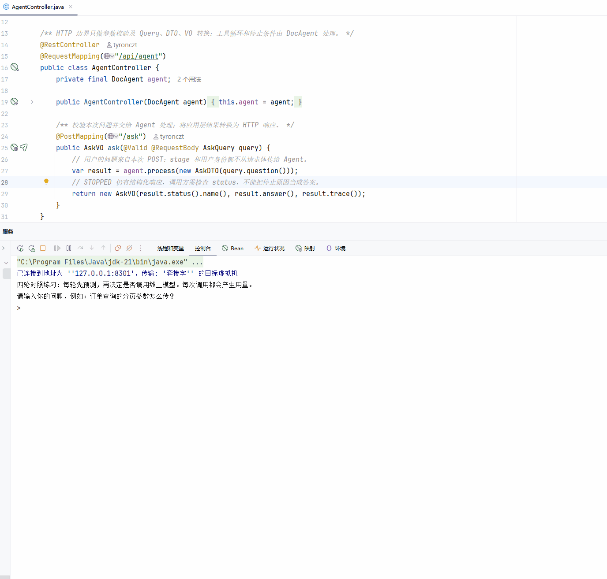
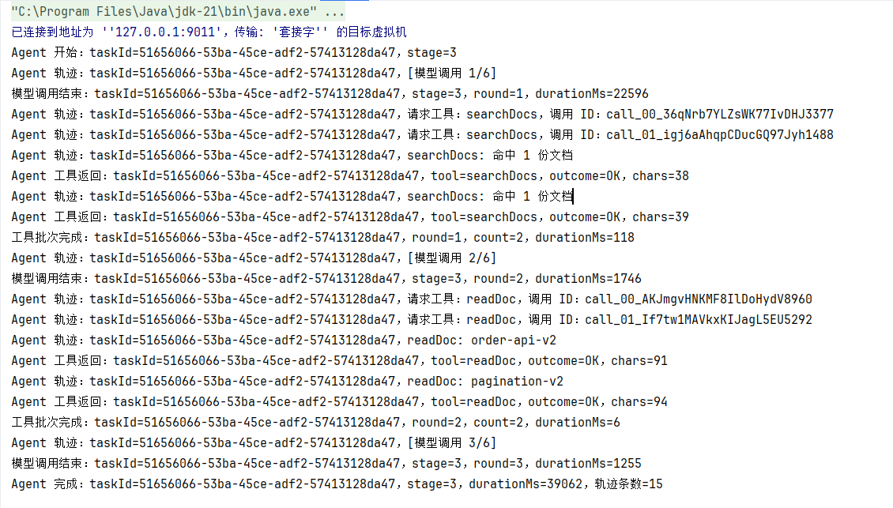
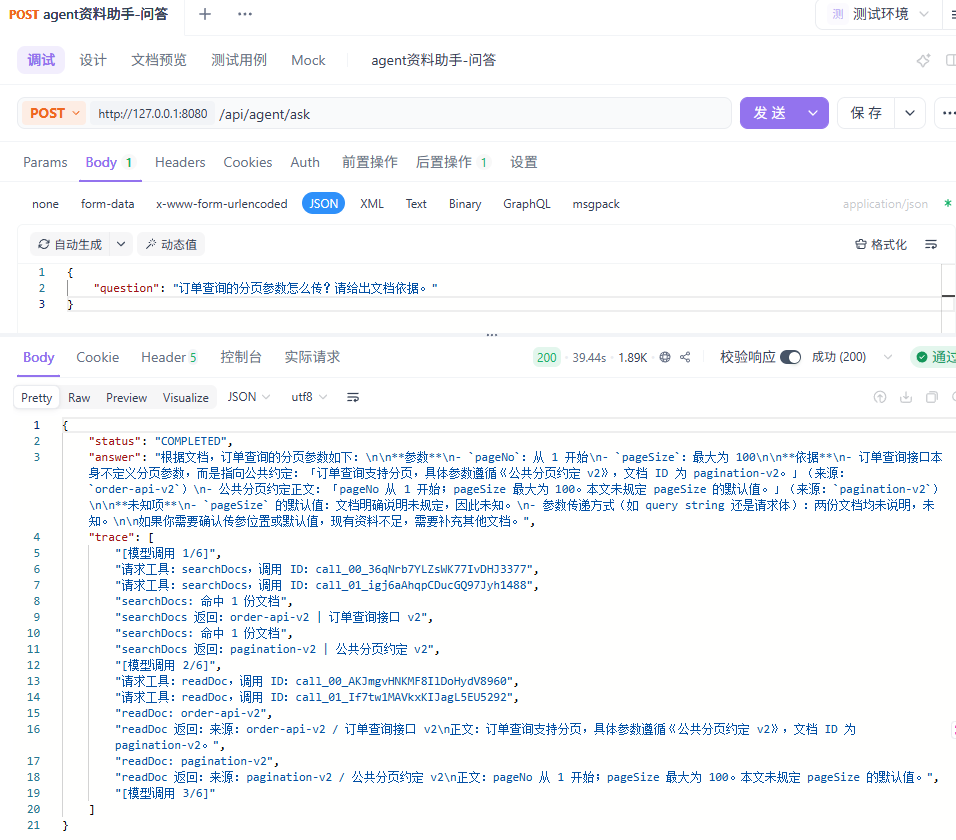

# Javaer转Agent：用 Java 做第一个 Agent

上一篇[《什么是 Agent》](01-what-is-agent.md)讲了一个资料助手。这次我们用 Java 做出它：你问“订单查询的分页参数怎么传”，它去找文档、读正文，再根据读到的内容回答。文档只有两份，方便你看清每一步。

这次实验要看清三件事：**回答规则不能代替资料；资料可以直接放进上下文，也可以由工具按需取回；工具结果必须交回模型，它才能决定下一步。** 全文沿用同一个分页问题。先用 `--guided` 比较四个阶段，再看资料、工具和循环怎样写成代码，最后把它接成 HTTP 接口。

[完整代码：GitHub / agent/zero-to-one](https://github.com/tyronczt/hello-ai/tree/main/agent/zero-to-one)。本文节选关键代码，完整项目、配置与注释以仓库为准。

## 0、先用 `--guided` 看四次变化

在 IDEA 中打开 `first-agent/pom.xml`，选择 JDK 21，运行 `example.agent.AgentApplication`。在运行配置的 **Program arguments（程序实参）** 中填 `--guided`。程序会在 Run 控制台等你输入问题；四轮都使用同一个问题，例如“订单查询的分页参数怎么传？请给出文档依据”。

| 你想观察什么 | 在控制台怎么做 | 能确认什么 |
|---|---|---|
| 只看准备给模型的内容 | 每轮预览出现后，在“你预测它会怎样回答或行动？”处输入 `s` | 跳过本轮模型调用，继续下一阶段；无需 API Key、不会产生模型用量 |
| 比较真实回答和工具过程 | 先写下预测，再在下一步按回车运行 | 调用 DeepSeek；需在运行配置的 **Environment variables（环境变量）** 中设置 `DEEPSEEK_API_KEY`，会产生用量 |

输入 `q` 可以退出练习。Key 的配置和保管方式见第 1.2 节；只看预览可以先跳过。下面的例子在阶段 1 输入 `s`，因此直接进入阶段 2，没有产生阶段 1 的实际回答：

```text
=== 阶段 1 增加任务规则 ===
本轮模型收到：
[system] ...只依据实际读到的正文回答...
[user] 订单查询的分页参数怎么传？请给出文档依据。
你预测它会怎样回答或行动？输入 s 不调用模型并进入下一阶段，输入 q 退出：
> s
=== 阶段 2 放入两份文档 ===
```

预览是便于阅读的摘要，不是发给模型的原始 HTTP 报文。四轮的变化如下；对照上一篇[《什么是 Agent》第 2 节](01-what-is-agent.md)，每轮问自己：**模型知道什么？它能采取什么行动？下一步由谁决定？**

| 阶段 | 这轮增加了什么 | 对应上一篇的概念 | 观察重点 |
|---|---|---|---|
| 0：只有问题 | 用户输入的目标 | 模型、幻觉 | 没有项目依据时，回答是否在猜 |
| 1：加回答规则 | “依据文档、未知就说明未知” | Prompt（提示词）、Context（上下文） | 没有资料时，能否承认不知道 |
| 2：直接给资料 | 两份文档的完整正文 | Context、知识来源、上下文窗口 | 能否从正文找依据；一次放入全部资料有什么代价 |
| 3：给查资料的工具 | `searchDocs`、`readDoc` 的使用说明 | Tool Calling、反馈循环、Harness | 模型请求什么；Java 执行后，模型怎样利用结果继续 |



先比较**阶段 0 与 1**：阶段 0 只有问题；阶段 1 多了“依据资料、未知就说明未知”的规则，但仍没有项目文档。模型即使碰巧说对 `pageSize`，也不能证明它找到了项目依据。再比较**阶段 1 与 2**：阶段 2 把两份正文直接放进本轮上下文，模型这时才有机会从资料读出 `pageNo`、`pageSize` 的规则。资料越多，这种全文发送方式消耗的 Token 越多，也会受上下文窗口限制。

最后比较**阶段 2 与 3**：阶段 3 初始消息不含正文，只提供搜索和读取工具。模型提出工具请求，Java 检查并执行，再把结果交回模型；模型可以根据新资料继续查询或回答。模型可能先搜索，也可能直接请求读取，实际顺序以运行记录为准。四阶段是程序安排的教学对照；在阶段 3 内部，后续行动才由模型根据工具反馈参与选择。

如果只输入 `s`，你确认的是每轮准备了什么，**不能据此断言模型实际调用了工具**。实际运行阶段 3 后，按这三步核对：

1. 找到“请求工具”：模型提出了什么动作？
2. 找到“`readDoc` 返回”：Java 是否读到了 `pagination-v2` 的正文？
3. 对照候选答案：参数和来源是否由读到的正文支持？

工具顺序可能变化，但答案碰巧正确、却没有读到所需文档，不算通过这次资料查询实验。详细读法见第 5 节。

需要单独重跑某一轮时，把 **Program arguments** 改为 `--stage=2 "你的问题"`，重新运行；清空参数则启动 HTTP 服务，不会自动提问。

## 1、准备环境和项目

### 1.1 本篇使用的技术组合

第一次跟着做，先确认 IDEA 使用 JDK 21、项目能导入 Maven。只看引导预览无需 API Key；需要调用模型时，再按第 1.2 节配置。下面的 Spring Boot 和 Spring AI 版本已经写在项目的 `pom.xml` 中，不用在 IDEA 里逐项填写。

| 项目          | 本篇选择                                       |
| ----------- | ------------------------------------------ |
| JDK         | 21                                         |
| Maven       | 3.9.x                                      |
| Spring Boot | 4.1.1                                      |
| Spring AI   | 2.0.1                                      |
| 模型服务        | DeepSeek 线上 API：`https://api.deepseek.com` |
| 模型          | `deepseek-flash`                           |
| 范围          | 本篇只验证 DeepSeek 主线；本地模型作为后续迁移练习             |

### 1.2 准备 DeepSeek API Key

只看 `--guided` 的预览，可以先跳过本节。要按回车运行阶段，或通过 HTTP 请求取得模型答案，再配置 Key。

在 [DeepSeek 开放平台](https://platform.deepseek.com/)创建 API Key，确认账户可调用 API。线上请求会产生用量，先使用本文两份教学资料，密钥通过环境变量提供，不写进代码或仓库。

在 IDEA 的 `example.agent.AgentApplication` 运行配置中，将 Key 填入 **Environment variables** 的 `DEEPSEEK_API_KEY`，HTTP 模式的运行步骤见第 6.4 节。不要打印密钥，也不要把它写进代码、日志或共享运行配置。这里不配置本地模型，Ollama 的安装与切换放在备选小节。

`application.yml` 的关键配置节选：

```yaml
spring:
  ai:
    openai:
      api-key: ${DEEPSEEK_API_KEY}
      base-url: ${DEEPSEEK_BASE_URL:https://api.deepseek.com}
      timeout: 120s
      max-retries: 0
      chat:
        completions-path: /chat/completions
        options:
          model: deepseek-flash
          max-tokens: 2048
          extra-body:
            thinking:
              type: disabled
```

`openai` 是 Spring AI 的协议适配配置名，不代表请求发给 OpenAI。`base-url` 和 `completions-path` 拼出 DeepSeek 的实际地址；显式设置路径，避免误用默认的 `/v1/chat/completions`。

`extra-body` 会将 `thinking` 放入请求 JSON 顶层，实际发送的是 `"thinking": {"type": "disabled"}`，不是一个叫 `extra_body` 的嵌套字段。[Spring AI OpenAI 配置](https://docs.spring.io/spring-ai/reference/api/chat/openai-chat.html)

完整配置还关闭了框架层重试，便于统计调用次数；`max-tokens` 只限制单次输出，不能代替整个任务的次数预算。HTTP 默认只监听 `127.0.0.1:8080`，教学日志单独设为 `INFO`，完整值见仓库配置文件。

DeepSeek 官方文档给出的模型名是 `deepseek-flash`，对话接口为 `https://api.deepseek.com/chat/completions`。本文通过 Spring AI 的 OpenAI 兼容协议适配器访问这个地址，实际服务和密钥均来自 DeepSeek。[DeepSeek 首次调用 API](https://api-docs.deepseek.com/zh-cn/)

本篇使用非思考模式，把注意力放在工具循环上。DeepSeek 默认开启思考模式，开启后还需要遵守 `reasoning_content` 的历史回传要求，因此配置会显式发送 `thinking.type: disabled`，不能仅靠删掉思考参数来关闭。[DeepSeek 思考模式](https://api-docs.deepseek.com/zh-cn/guides/thinking_mode/)

### 1.3 打开现成的 Maven 项目

完整示例已经在仓库的 `first-agent` 目录中。用 IDEA 打开它的 `pom.xml` 即可，不必照着下面的目录图手工创建文件。先认三个类：`AgentApplication` 负责启动，`DemoRunner` 带你做练习，`DocAgent` 负责调用模型和工具。

项目目录如下，其他类会在用到时再介绍：

```text
first-agent/
├── pom.xml
└── src/main/
    ├── java/example/agent/
    │   ├── AgentApplication.java
    │   ├── demo/DemoRunner.java
    │   ├── service/DocAgent.java
    │   ├── tool/DocTools.java
    │   ├── dto/{AskDTO,AgentResultDTO}.java
    │   └── web/{AgentController,query/AskQuery,vo/AskVO}.java
    └── resources/application.yml
```

[GitHub 上的完整 Maven 项目](https://github.com/tyronczt/hello-ai/tree/main/agent/zero-to-one/first-agent)包含 `pom.xml`、配置和全部 Java 文件。IDEA 导入 Maven 项目后会读取这些依赖，你不必逐个安装：

| 作用 | 已使用的依赖 |
|---|---|
| 模型协议适配 | `spring-ai-starter-model-openai`，通过 Spring AI BOM 统一版本 |
| HTTP 接口 | `spring-boot-starter-webmvc` |
| 请求校验 | `spring-boot-starter-validation` |

导览展示 **HTTP 入口**：`AgentController.ask() → DocAgent.process() → run() → execute()`；第 0 节的 `--guided` 则由 `DemoRunner` 调用 `DocAgent.runStage()`。两条路径都进入 `DocAgent`，但只有 HTTP 入口固定执行第 3 阶段。你可以在下图切换「调用流程」和「交互时序」，点击节点查看源码，再用「直接回答」「工具循环」「停止条件」聚焦分支。

<iframe src="first-agent/ask-call-flow.html" title="AgentController.ask 调用流程与交互时序导览" width="100%" height="960" loading="lazy" style="border: 0;"></iframe>

[独立打开或下载交互导览（HTML）](first-agent/ask-call-flow.html)。如果阅读器不显示上面的交互区域，下载该文件后用浏览器打开即可，无需启动 Java 服务或调用模型。图中展示的是源码允许的路径，所附代码是生成时的快照；实际请求走过哪些工具，仍以本次返回的 `trace` 为准。

## 2、看看程序手里有什么资料

用户输入：

> 订单查询的分页参数怎么传？请给出文档依据。

教学资料只有两份：

| 文档 ID | 标题 | 正文要点 |
|---|---|---|
| `order-api-v2` | 订单查询接口 v2 | 分页规则见 `pagination-v2` |
| `pagination-v2` | 公共分页约定 v2 | `pageNo` 从 1 开始，`pageSize` 最大为 100，未规定默认值 |

这些参数是本篇编的教学资料，不是通用规范。第一份文档只说“去看公共分页约定”，第二份才写了具体数值。第 2 阶段把两份正文直接交给模型；第 3 阶段让模型自己用工具去取。

第 0 节的四阶段预览来自同一个 `initialMessages` 方法。阶段 0 只有用户问题；阶段 1 加入任务规则；阶段 2 把两份正文放进用户消息；阶段 3 的初始消息只有规则和问题，工具定义会另外放进模型选项：

```java
public static List<Message> initialMessages(String question, int stage) {
    if (stage == 0) {
        return List.of(new UserMessage(question));
    }
    return List.of(new SystemMessage(SYSTEM), new UserMessage(stage == 2
            ? "教学资料：\n" + DocTools.demoContext() + "\n问题：" + question : question));
}
```

`DemoRunner` 的预览和实际执行都调用它，因此同一阶段的初始消息一致。阶段 0～2 各调用模型一次，不注册工具；阶段 3 才进入后面的工具循环。这里的消息是一次任务的当前上下文，不会自动保留到下一个用户请求。

阶段 2 把全文直接放进消息，没有检索过程；阶段 3 用简单的标题搜索和读取工具按需取得资料，不依赖向量数据库。这两轮的差别在于资料**何时、由谁**放进模型上下文。

程序提供两个动作：`searchDocs` 根据关键词返回文档 ID 和标题，`readDoc` 读取指定正文。至于先查什么、读到引用后是否继续查，由模型根据结果选择。

本篇使用固定、公开的教学数据，没有文件写入和业务操作。HTTP 请求可以由多个用户同时发起；真实资料的权限、身份和会话记忆仍需另行实现。

## 3、把 Java 方法变成两个工具

`DocTools` 提供两个普通 Java 方法。`searchDocs(keyword)` 像查目录，只返回文档 ID 和标题；`readDoc(docId)` 像翻开其中一页，才会返回正文。例如先搜索“订单”得到 `order-api-v2`，再读取它，才能看到“分页规则在 `pagination-v2`”这句话。模型还要继续读 `pagination-v2`，才能得到具体参数。

下面节选 `readDoc`。`@Tool` 描述动作，`@ToolParam` 描述模型需要提供的参数；Java 仍要在方法入口校验模型生成的值：

```java
/**
 * 只接受固定集合中的精确文档 ID；不会将 ID 当成本地路径或 URL。
 * 格式错误和文档不存在都作为明确结果回给模型，便于它修正或停止。
 */
@Tool(description = "根据搜索结果或正文引用中的文档 ID 读取教学文档。")
public String readDoc(
        @ToolParam(description = "精确的文档 ID，例如 order-api-v2") String docId) {
    if (docId == null || !docId.matches("[a-z0-9-]{1,64}")) {
        String result = "INVALID_ARGUMENT: 文档 ID 格式不正确。";
        trace.accept("readDoc 返回：" + result);
        return result;
    }
    for (Doc doc : DOCS) {
        if (doc.id().equals(docId)) {
            trace.accept("readDoc: " + doc.id());
            String result = "来源：" + doc.id() + " / " + doc.title() + "\n正文：" + doc.content();
            // 仅因资料公开且固定才把正文放进返回轨迹；真实业务文档须按身份授权并收紧轨迹。
            trace.accept("readDoc 返回：" + result);
            return result;
        }
    }
    String result = "NOT_FOUND: 指定文档不存在。";
    trace.accept("readDoc 返回：" + result);
    return result;
}
```

`@Tool` 是给模型看的方法说明。模型可以提出“请调用 `readDoc`”，真正运行这个 Java 方法的是应用程序。看到工具请求，不等于已经读到了文档；还要看工具的返回值。[完整的 DocTools.java](https://github.com/tyronczt/hello-ai/blob/main/agent/zero-to-one/first-agent/src/main/java/example/agent/tool/DocTools.java)包含标题搜索和两份固定教学资料。

这里有两个刻意保留的区别：

- 搜索只返回标题和 ID，读取才返回正文。因此，找到标题并不等于已经取得回答依据。
- “没找到”和“参数不合法”返回明确结果，模型可以据此调整查询或说明问题；它们不是一段空字符串。

`readDoc` 不接受真实文件路径，也没有访问项目目录的能力。这个固定集合不是多用户权限系统；接入真实文档时，搜索和读取都需要根据服务端可信身份过滤与鉴权。

为了让教学过程可观察，这两份**公开固定资料**的返回内容会写入本次请求的 `trace`，随 HTTP 响应返回；命令行练习通过 SLF4J 日志展示轨迹。真实项目文档不应照搬全文轨迹，应按权限处理响应与日志。

## 4、写出 Agent 的执行循环

### 4.1 先看我们要控制的过程

回想刚才查资料的过程：模型先说“帮我找订单文档”，Java 搜索后把结果交给它；模型再说“读这份文档”，Java 读完再交给它。模型拿到足够的正文后，才给出答案。代码就是重复做这几步：

```text
把问题发给模型 → 模型回答了吗？
  回答了：结束
  请求工具：Java 检查并执行 → 把结果交给模型 → 再判断一次
```

本例故意自己写这个循环，好让你看到是谁调用模型、是谁运行 Java 方法。所用 Spring AI 2.0 的 `ChatModel` 不会自动执行模型提出的工具请求；代码要显式调用 `ToolCallingManager`。以后也可以让 `ChatClient` 和 `ToolCallingAdvisor` 管理循环。[Spring AI 2.0 工具执行说明](https://docs.spring.io/spring-ai/reference/api/tools.html)

### 4.2 只看决定下一步的代码

`--guided` 的阶段 3 和 HTTP 请求都会走 `DocAgent` 的工具循环。先把关键代码连起来看：`options` 提供模型设置和工具定义，`prompt` 保存本轮消息；模型返回后，Java 决定结束还是执行工具。下面省略了轨迹日志、空响应与超时处理，[完整 DocAgent.java](https://github.com/tyronczt/hello-ai/blob/main/agent/zero-to-one/first-agent/src/main/java/example/agent/service/DocAgent.java)保留了这些分支。

```java
var options = OpenAiChatOptions.builder()
        .model("deepseek-flash")
        .temperature(0.0)
        .maxTokens(2048)
        .extraBody(Map.of("thinking", Map.of("type", "disabled")))
        .toolCallbacks(ToolCallbacks.from(new DocTools(event -> addTrace(trace, taskId, event))))
        .build();
var prompt = new Prompt(initialMessages(question, stage), options);
int toolCalls = 0;

for (int round = 1; round <= MAX_MODEL_CALLS; round++) {
    var response = model.call(prompt);
    var output = response.getResult().getOutput();
    if (!response.hasToolCalls()) {
        String answer = output.getText();
        return answer == null || answer.isBlank()
                ? stopped("模型返回空答案。", trace)
                : completed(answer, trace);
    }
    var calls = output.getToolCalls();
    if (round == MAX_MODEL_CALLS || calls.size() > MAX_TOOL_CALLS - toolCalls) {
        return stopped("剩余调用预算不足，尚未完成。", trace);
    }
    if (calls.stream().anyMatch(call -> !ALLOWED_TOOLS.contains(call.name()))) {
        return stopped("模型请求了未开放的工具。", trace);
    }
    toolCalls += calls.size();
    var result = manager.executeToolCalls(prompt, response);
    prompt = new Prompt(result.conversationHistory(), options);
}
return stopped("模型调用预算耗尽，尚未完成。", trace);
```

### 4.3 读懂最关键的几行

沿着上面的代码，先抓住五个位置，就能看清模型与 Java 怎样配合完成任务。

1. **注册工具：`ToolCallbacks.from(...)`。** 把 `DocTools` 中的 `searchDocs`、`readDoc` 方法转换成 Spring AI 的工具回调，再通过 `.toolCallbacks(...)` 放进请求选项。模型由此知道工具的用途和参数，可以提出调用请求；注册时并没有执行这些方法。

2. **请求模型：`var response = model.call(prompt)`。** 把当前消息和请求选项交给模型，取得这一次响应。第一次的消息是任务规则和用户问题；执行过工具后，后续消息还会包含工具请求及结果。这一行位于循环中，所以模型可以根据新资料再次决定下一步。

3. **判断分支：`if (!response.hasToolCalls())`。** 没有工具请求时，程序取出文字，非空才作为候选答案返回；有工具请求时，继续检查预算和工具名称。有些响应同时包含文字和工具请求，本例会先处理工具，不把附带的文字当成最终答案。

4. **执行工具：`var result = manager.executeToolCalls(prompt, response)`。** 前面的检查通过后，`ToolCallingManager` 根据模型请求的工具名和参数调用对应 Java 方法，取得执行结果。模型负责提出调用，真正读取资料的是 Java 工具代码。

5. **回填历史：`prompt = new Prompt(result.conversationHistory(), options)`。** `conversationHistory()` 包含前面的对话、本次模型的工具请求和对应工具结果。用它更新 `prompt` 后，循环回到下一次 `model.call(prompt)`，模型才能根据刚查到的资料继续判断。

最后两步把反馈接回了模型：**执行工具 → 回填上下文 → 再次调用模型**。例如，`readDoc` 返回的订单文档提到《公共分页约定 v2》，并给出文档 ID `pagination-v2`；这段内容进入下一轮消息，模型才有依据决定继续读取这份约定。仅仅执行 Java 方法或打印结果，并不会自动让模型知道查到了什么。

`addTrace` 是辅助观察代码，用来记录模型轮次、工具请求和返回事件，供控制台排查及接口返回。要区分：**`trace` 是给人看的执行记录，`conversationHistory()` 是给模型继续使用的消息历史**。本例的教学 `trace` 会包含固定公开资料的正文，运行日志只记录过程信息、状态和耗时；接入真实业务文档时，需要收紧返回内容。

`prompt` 和计数器都是本次 `execute` 调用的局部变量，每次任务重新创建。本例不会把上一个问题的历史带入下一个问题，也没有实现跨轮用户会话记忆。

### 4.4 为什么要有停止条件

例子限制最多 6 次模型调用和 8 次工具调用。两者分开计数，因为模型一次可能请求多个工具；最后一轮若仍要求工具，程序会停止，避免执行完却没有预算再取得答案。

5 分钟是轮次间检查的任务预算，**不是能强行中断所有阻塞操作的硬截止时间**。配置文件另设 OpenAI 兼容客户端的单次请求超时 120 秒；正在进行的请求可能越过任务预算，返回后才被判定超时。

Java 只允许 `searchDocs` 和 `readDoc`，还会检查参数。模型或工具出错时，程序返回停止原因，不编一个答案。HTTP 返回 `COMPLETED` 只表示模型给出了候选答案，仍要看文档是否支持它的说法。

### 4.5 这些“护栏”叫什么

除了循环，`DocAgent` 还管调用次数、超时和允许使用的工具；`DocTools` 检查工具参数。这些帮助模型完成任务、又防止它无限调用或随意执行的程序代码，常被叫作 **harness**。在本例中，模型提出“想读哪份文档”，Java 决定“能不能读、读完返回什么”。

这套护栏还不能自动判断自然语言答案是否有依据，也不能在程序重启后恢复中途的任务。所以响应写的是“候选答案”，需要对照实际读取的文档核查。接入真实业务资料时，还要按用户身份控制可读范围；若增加写操作，则要处理审批、幂等、事务和回滚。

## 5、用执行轨迹验证 Agent 循环

先用一次真实 HTTP 请求的记录读懂执行过程；下一节再介绍如何发起 HTTP 请求。用户问“订单查询的分页参数怎么传？”，这次返回的 `trace` 记录了三次模型调用。`1/6` 表示“最多可调用模型 6 次，现在是第 1 次”，不是第 1 个教学阶段。按顺序看：

| 顺序 | 模型这次返回了什么 | Java 做了什么 | 下一次模型调用能看到什么 |
|---|---|---|---|
| 第 1 次模型调用 | 提出 **两次** `searchDocs` 请求 | 执行两次搜索，分别返回 `order-api-v2`、`pagination-v2` 的 ID 和标题 | 搜索结果；**还没有文档正文** |
| 第 2 次模型调用 | 根据搜索结果提出 **两次** `readDoc` 请求 | 读取两份固定教学文档，把正文作为工具结果回填 | 订单接口引用分页约定，以及 `pageNo`、`pageSize` 的具体规则 |
| 第 3 次模型调用 | 不再请求工具，返回文字答案 | 将文字放入 `answer`，以 `COMPLETED` 结束本次任务 | 本次任务结束 |

这次模型调用了 **3 次**，Java 工具执行了 **4 次**。因为一次模型响应可以提出多个工具请求，两个数字不必相等。



看到 `请求工具：...`，表示模型**想让 Java 做**这件事。看到 `searchDocs 返回：...` 或 `readDoc 返回：...`，才表示 Java 做完了。`调用 ID` 是配对工具请求和结果用的编号；`order-api-v2` 才是文档 ID。

对照第 4 节的代码：`model.call(prompt)` 得到工具请求，`manager.executeToolCalls(prompt, response)` 执行 Java 方法，`conversationHistory()` 把结果带入下一轮。第 3 次模型不再请求工具，程序取出文字，以 `COMPLETED` 返回候选答案；答案是否正确，仍要看读过的正文。

本例 `DocTools` 查询的是 Java 代码里固定的两份教学文档，没有查询真实订单、数据库或向量库。要核验这次答案，重点看 `readDoc 返回` 是否真的包含“`pageNo` 从 1 开始、`pageSize` 最大为 100、默认值未规定”。模型下次可能先读一份文档再读另一份，也可能一次请求多个工具；程序没有写死固定路径。

响应里的 `trace` 没记录搜索关键词，单凭截图不能反推出模型传了什么关键词。

## 6、把实验接成 HTTP 接口

练习时，你在 IDEA 控制台输入问题。做成接口后，用户在 HTTP 请求里输入问题。接口不会替用户预设问题，也不让用户指定教学阶段。

HTTP 请求长这样。`question` 是这次用户自己输入的问题：

```http
POST /api/agent/ask
Content-Type: application/json

{"question":"订单查询的分页参数怎么传？请给出文档依据。"}
```

```text
用户提交 question → Controller 接收 → DocAgent 处理 → 返回 answer 和 trace
```

### 6.1 定义入参和出参

你只需提交 `question`。代码用几个名字不同的对象传递它：`AskQuery` 接收并检查 HTTP 请求；`AskDTO` 把问题交给 Agent；`AgentResultDTO` 装处理结果；`AskVO` 把结果交还给用户。它们是程序不同位置使用的数据外壳，不是要你填写四次。空问题或超过 1000 字的问题会返回 HTTP 400。[Spring MVC 请求体验证](https://docs.spring.io/spring-framework/reference/web/webmvc/mvc-controller/ann-methods/requestbody.html)

| 字段 | 作用 |
|---|---|
| `question` | 用户本次提交的问题；不从代码中预设 |
| `status` | `COMPLETED` 表示得到候选答案，`STOPPED` 表示任务未完成 |
| `answer` | 候选答案或停止原因，需结合 `status` 解读 |
| `trace` | 本次请求的模型轮次与工具记录 |

这些对象的[完整声明与注释](https://github.com/tyronczt/hello-ai/tree/main/agent/zero-to-one/first-agent/src/main/java/example/agent)在仓库中。`COMPLETED` 不代表答案事实已自动核验；真实业务资料也不应直接把全文放进 `trace` 返回。

### 6.2 Controller 只做边界转换

`POST /api/agent/ask` 只接受 `question`。下面是 [AgentController.java](https://github.com/tyronczt/hello-ai/blob/main/agent/zero-to-one/first-agent/src/main/java/example/agent/web/AgentController.java) 的入口方法：

```java
@PostMapping("/ask")
public AskVO ask(@Valid @RequestBody AskQuery query) {
    // 用户的问题来自本次 POST；stage 和用户身份都不从请求体传给 Agent。
    var result = agent.process(new AskDTO(query.question()));
    // STOPPED 仍有结构化响应，调用方需检查 status，不能把停止原因当成答案。
    return new AskVO(result.status().name(), result.answer(), result.trace());
}
```

这段方法只做两件事：接收用户问题，把 Agent 的结果交还给用户。查资料和决定何时停止，都在 `DocAgent` 里。这个示例没有登录和权限控制；以后接入真实文档时，搜索和读取都要按已认证的用户身份检查权限。

### 6.3 启动入口与教学流程分开

[AgentApplication.java](https://github.com/tyronczt/hello-ai/blob/main/agent/zero-to-one/first-agent/src/main/java/example/agent/AgentApplication.java)根据启动参数选择入口：留空时启动 HTTP 服务；`--guided` 进入第 0 节的四阶段练习；`--stage=2 "你的问题"` 直接运行指定阶段。教学模式会设置 `WebApplicationType.NONE`，让 Spring 运行 [DemoRunner.java](https://github.com/tyronczt/hello-ai/blob/main/agent/zero-to-one/first-agent/src/main/java/example/agent/demo/DemoRunner.java)，但不启动 HTTP 服务。

`DemoRunner` 只负责展示、预测和选择，实际调用路径是 `DemoRunner.show() → DocAgent.runStage() → model.call()`；HTTP 请求则经过 `AgentController.ask() → DocAgent.process()`，固定运行阶段 3。HTTP 调用的详细路径可以回看第 1.3 节的交互导览。

### 6.4 在 IDEA 启动 HTTP 服务

沿用第 0 节的 `example.agent.AgentApplication` 运行配置：按第 1.2 节设置 `DEEPSEEK_API_KEY`，把 **Program arguments（程序实参）清空**，再点击运行。服务启动后会等待 HTTP 请求，不会自动发送订单问题。

不要勾选 **Store as project file / Share through VCS**，运行配置可能明文保存密钥。在 IDEA Terminal 中设置环境变量，也不会自动传给工具栏的 Run 配置。[JetBrains 环境变量说明](https://www.jetbrains.com/help/idea/program-arguments-and-environment-variables.html)

保持 IDEA 中的服务运行，在 PowerShell 中发起请求：

```powershell
$body = @{ question = '订单查询的分页参数怎么传？请给出文档依据。' } | ConvertTo-Json -Compress
Invoke-RestMethod -Uri 'http://127.0.0.1:8080/api/agent/ask' -Method Post -ContentType 'application/json; charset=utf-8' -Body ([Text.Encoding]::UTF8.GetBytes($body))
```

把 `$body` 中的问题换成你的问题即可。下面只是响应形状示意，具体答案和工具顺序以实际返回为准：

```json
{
  "status": "COMPLETED",
  "answer": "pageNo 从 1 开始，pageSize 最大为 100；资料未规定默认值。来源：pagination-v2。",
  "trace": ["[模型调用 1/6]", "请求工具：readDoc，调用 ID：...", "readDoc 返回：来源：pagination-v2 / ..."]
}
```



参数不合法返回 HTTP 400。正常处理的请求返回 HTTP 200；模型或工具中途停止时，响应里的 `status` 为 `STOPPED`，`answer` 是停止原因，不是问题答案。`COMPLETED` 也只表示得到了候选答案，仍需用第 5 节的方法核对资料依据。

想在 IDEA 中亲眼看一遍，用 **Debug** 启动 HTTP 服务，发送同一个 POST，然后依次停在：

1. `AgentController.ask()`：看 `query.question()`，确认这是用户刚提交的问题。
2. `DocAgent` 中的 `model.call(prompt)`：看模型这轮是否请求工具；再停在 `manager.executeToolCalls(...)`，看 Java 何时执行。
3. `DocTools.searchDocs()` / `readDoc()`：看实际传入的参数和返回值。工具执行后，看 `result.conversationHistory()` 如何成为下一次调用的 `prompt`。

### 6.5 多用户时状态放在哪里

`DocAgent` 是单例处理器，但每次 `process()` 都新建消息历史、工具实例、轮次计数与轨迹列表；共享的教学文档集合不可变。并发请求不会把甲的工具结果带进乙的下一轮。当前服务没有跨请求会话记忆，连续两次 POST 也是两个独立任务。

本例默认只监听本机，也没有登录、限流和用量配额。要给多设备、多用户使用，应先接入可信的鉴权入口，再开放监听地址；真实资料还要按身份过滤搜索和读取结果。`AGENT_PORT` 可以更改本机端口，`AGENT_BIND_ADDRESS` 可配置监听地址，但配置它不等于获得了鉴权能力。

## 7、跑通以后，再做几项检查

先用三个问题验收主要结果；每次都检查实际读到的文档和答案依据，不能只看返回的数字。

| 检查 | 怎么操作 | 看什么 |
|---|---|---|
| 跨文档查询 | POST 提交“订单查询的分页参数怎么传？请给出文档依据。” | 是否读取相关正文，参数及来源是否正确 |
| 资料没写的值 | 询问 `pageSize` 默认值 | 应说明文档未规定，不能补出 10 或 20 |
| 超出资料范围 | 询问退款到账时间 | 应说明没有相应依据 |

再检查失败和停止条件：

| 检查 | 怎么操作 | 看什么 |
|---|---|---|
| 文档缺失 | 临时移除公共约定，在 IDEA 中重新运行并提问 | 应报告缺失，不能假装读过 |
| 调用次数限制 | 临时将 `MAX_MODEL_CALLS` 改为 1 | 若模型请求工具，应在执行前停止 |
| 服务不可用 | 临时将 `DEEPSEEK_BASE_URL` 指向本机未监听的端口 | 应返回失败提示，不输出虚假的成功答案 |

测试完成后恢复教学数据、调用预算及服务地址。重复运行会产生新的线上用量，用少量固定问题检查是否有漏查或错误引用即可。

工具是否执行、次数限制是否生效，可以通过确定性测试验证；模型是否总能选择合适路径，需要真实模型上的重复评测。两类检查解决的问题不同。

要进一步观察反馈的作用，可以把订单文档正文改成完整的分页说明，再在 IDEA 中重新运行。模型可能直接结束；也可以保留引用但删掉公共约定，观察它能否说明资料缺失。

### 7.1 想看得更明白，再做三组对照

**先比较阶段 1 和 2。** 两轮都有“只按资料回答”的规则，只有阶段 2 真正带了文档正文。看阶段 1 会不会在没资料时猜 `pageSize`；再看阶段 2 能不能从正文读出“最大 100、默认值未规定”。这能说明：加规则不能代替给资料。

**再比较阶段 2 和 3。** 阶段 2 一开始就把两份正文都发给模型。阶段 3 一开始只有工具说明；读到 `pagination-v2` 后，正文才进入下一次模型请求。看这一步，才能确认答案来自工具返回的资料。资料只有两份时，直接发送全文更简单；文档多了，再考虑检索。

**最后看工具结果有没有回到模型。** 模型提出 `readDoc` 请求后，Java 必须真的执行，并把正文放进下一次请求。重点看“模型请求 → Java 执行 → 下一轮看到结果”这三步。不要故意向线上接口发送不成对的工具消息；协议可能直接拒绝，测不到模型的回答能力。

这三组对照只验证输入和控制流的作用。要评估回答质量，固定题目及教学资料版本，分别记录“读到了哪些文档、答案哪句话由哪段正文支持、未规定字段是否被编造”，重复运行后再比较。对于真实项目，还应把权限拒绝、资料更新和服务超时加入样例集。

## 8、遇到问题或想继续扩展时再看

### 8.1 模型能聊天，却不调用工具

先确认使用的模型支持工具调用，再看工具是否随请求传入。工具描述也要明确，尤其是搜索返回标题、读取返回正文的区别。

如果程序没有 `readDoc` 执行记录，却输出了一份看似正确的参数说明，不算通过本篇的资料查询测试。模型可能根据常见分页习惯猜中了数值。

### 8.2 为什么搜索“订单 分页”找不到

本例只是标题包含匹配，不做分词或语义检索，因此工具说明要求使用一个简短关键词。失败时工具返回提示，模型可以改用“订单”或“分页”。

真实资料增多、表达方式变复杂后，再替换搜索实现。模型决策、工具执行和反馈这条主线可以保留。

### 8.3 一直查、查得慢，怎么排查

先看最后一条记录。如果停在模型调用，检查 DeepSeek 连接、账户可用额度及服务响应；401 通常先核对密钥，429 则检查限速，不要无限重试。若返回 400，核对接口路径、请求参数和工具历史；涉及 `reasoning_content` 时，先确认关闭思考的配置是否实际生效。如果同一工具反复出现，检查返回值是否补充了信息，以及文档引用是否缺失。

不要直接把调用次数调大。先用实际轨迹解释为什么需要下一次调用，再决定是否增加预算。

### 8.4 离真实项目还差什么

这个例子只处理固定教学文档，异常时通过 `status: STOPPED` 返回停止原因。HTTP 已提供结构化任务结果，但没有持久化恢复、自动核验引用、多用户鉴权或业务写操作。

每次请求都重新开始，没有跨请求的会话记忆；两个工具是本地 Java 方法，没有使用 MCP；任务规则写在提示词中，没有做成 Skill。这些能力解决的是不同问题，应在需要时分别引入。

后续可以按需求扩展：资料量变大时改进检索，多轮提问时引入会话记忆，对外提供服务时补充可信身份和任务管理。加入写操作前，还要落实业务状态校验、幂等与授权。

本篇先完成一件事：让模型能够选择 Java 工具，执行结果能够返回模型，并让这个过程有记录、能停止。

### 8.5 备选：迁移到本地模型

想试本地模型，可以参考 [Ollama 工具调用说明](https://docs.ollama.com/capabilities/tool-calling)另开分支。本例用了 DeepSeek 专属的 `thinking` 参数和 `OpenAiChatOptions`；换模型时，依赖、连接地址和这些选项都要一起调整，再检查工具调用记录。本篇没有验证 Ollama，不能只改 POM 和 YAML 就认为迁移完成。

### 8.6 下一篇：让 Spring AI 管理工具循环与多轮对话

到这里，我们已经能解释手写循环。按照[学习路线](README.md)的下一阶段，建议继续写《Javaer转Agent：让 Spring AI 管理工具循环与多轮对话》，仍使用同一个资料助手：

1. 用 `ChatClient` 及框架支持的工具执行机制替换手写循环，对照原有记录，确认由谁执行工具、怎样停止。
2. 连续提问“分页参数怎么传？”和“那它的默认值呢？”，观察第二次请求必须带上哪些历史。
3. 引入会话 ID，隔离不同会话的消息，区分一次任务内部的工具历史与用户多轮对话。
4. 加入“需要补充版本信息”的问题，用户回答后继续，并说明内存状态在重启后会丢失。
5. 复用本篇的检查用例，保留权限、次数与超时约束，不把框架托管等同于自动具备所有保护。

这一篇解决“从一次性任务走向可连续交互的助手”。随后再按问题扩展：文档增多时学习 RAG；工具需要跨应用复用时学习 MCP；出现明确分支、审批或重启恢复需求时，再学习状态管理与图编排。

## 9、参考资料与验证范围

截至 2026-09-23，Spring 官方把 Spring AI 2.0.1 列为最新稳定版；它面向 Spring Boot 4.0/4.1，本例使用已发布的 Boot 4.1.1。版本号是本篇可复现组合，不是要求你在自己的业务项目里立刻升级。[Spring AI 稳定版本](https://docs.spring.io/spring-ai/reference/spring-projects.html) · [2.0 升级说明](https://docs.spring.io/spring-ai/reference/upgrade-notes.html) · [Spring Boot 4.1.1 运行要求](https://docs.spring.io/spring-boot/system-requirements.html)

四阶段对照借鉴了[《深入理解 AI Agent》第一章](https://bojieli.github.io/ai-agent-book/book/chapter1/)的实验思路，也参考了[Javaer 转 Agent 学习资料篇](https://tyron.me/posts/agent-resources)的选材方式。订单文档和 Java 程序是本篇重新设计的教学案例，下面的示意输出不代表原书的实验结果。

- [DeepSeek 首次调用 API](https://api-docs.deepseek.com/zh-cn/)：线上地址、模型名与认证方式。
- [DeepSeek 思考模式](https://api-docs.deepseek.com/zh-cn/guides/thinking_mode/)：开关及工具调用时的历史回传要求。
- [《深入理解 AI Agent》第一章](https://bojieli.github.io/ai-agent-book/book/chapter1/)：上下文组件对照实验与 Model / Harness 边界。
- [Javaer 转 Agent 学习资料篇](https://tyron.me/posts/agent-resources)：Java 主线与小型教学项目选材。
- [Spring AI 2.0.1 稳定版本](https://docs.spring.io/spring-ai/reference/spring-projects.html)与[升级说明](https://docs.spring.io/spring-ai/reference/upgrade-notes.html)：版本和工具循环迁移。
- [Spring AI 2.0 工具调用](https://docs.spring.io/spring-ai/reference/api/tools.html)：工具注册、手动循环与消息回填。
- [Spring AI OpenAI 兼容配置](https://docs.spring.io/spring-ai/reference/api/chat/openai-chat.html)：请求超时与额外请求字段。
- [Ollama 工具调用](https://docs.ollama.com/capabilities/tool-calling)：待单独验证的本地模型迁移入口。

此前已在 JDK 21、Maven 3.9.11 下完成编译和打包。本机模拟 DeepSeek 接口检查了请求地址、认证头、模型名、思考模式开关和输出上限，也检查了跨文档结果回填、未开放工具、重复调用、文档缺失、工具超额、非法参数和空回答。HTTP 层检查了空问题返回 400、POST 返回答案和轨迹，以及三个并发问题不会串到一起；第 0～2 阶段的请求内容也用本机模拟服务核对过。

上面是**本机模拟验证**。此外，读者提供的一次真实 DeepSeek HTTP 调用返回了 `COMPLETED`，轨迹中有 3 次模型调用和 4 次工具执行，第 5 节据此讲解。这只说明该次请求跑通；模型换个问题或重跑一次，选工具的路径可能不同。Ollama 路径尚未验证。
