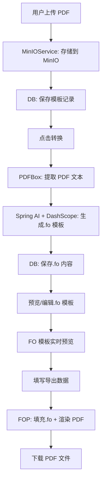

## 产品概述

基于 Spring Boot 的 PDF 模板导出系统，实现 PDF 模板上传、AI 转换为 XSL-FO 模板、数据填充导出三大核心功能。

## 核心功能

- **PDF 模板上传**：用户通过 Web 页面上传 PDF 文件，文件存入 MinIO（bucket: pdfexport），模板元信息存入 MySQL
- **AI 转换为 .fo 模板**：Spring AI 调用 DashScope 大模型，提取 PDF 内容并生成带占位符的 XSL-FO 模板文件
- **模板预览与编辑**：在 Web 页面预览 .fo 模板内容，支持手动编辑占位符
- **FO 模板实时预览**：在线输入占位符数据，实时生成 PDF 预览效果，所见即所得
- **数据填充导出 PDF**：将数据库中的业务数据根据 .fo 模板占位符进行填充，通过 Apache FOP 生成最终 PDF 文件并下载

## 技术选型：PDF 解析工具对比（PDFBox vs MinerU）

### 对比总览

| 维度 | Apache PDFBox | MinerU（上海人工智能实验室） |
| --- | --- | --- |
| **语言生态** | Java 原生，Maven 直接引入 | Python 为主，提供 HTTP API |
| **核心能力** | PDF 读取/创建/文本提取/表单处理 | AI 驱动文档解析，PDF→Markdown/JSON |
| **文本提取** | 基础文本提取，顺序可能错乱 | 智能布局识别，保留阅读顺序，过滤页眉页脚 |
| **表格支持** | ❌ 不支持表格结构化解析 | ✅ 精准还原复杂表格（合并单元格、跨页、旋转） |
| **公式支持** | ❌ 不支持 | ✅ 长公式、多行公式、嵌套结构，输出 LaTeX |
| **中文支持** | ✅ 支持中文文本提取 | ✅ 多语言 OCR 支持 |
| **部署依赖** | 无特殊依赖，JVM 即可 | 需 Docker + CUDA GPU 环境（离线部署） |
| **集成复杂度** | 低，`pdfbox` Maven 依赖即可 | 较高，需部署服务或调用在线 API |
| **性能** | 快，纯 Java，无外部依赖 | 慢，依赖深度学习模型推理 |
| **输出格式** | 纯文本/字符串 | Markdown、JSON、LaTeX、CSV、HTML |
| **开源协议** | Apache 2.0 | AGPL-3.0 |


### 选型结论：Apache PDFBox

**选择理由**：

1. **Java 原生**：与 Spring Boot 项目无缝集成，零外部依赖，Maven 引入即可使用
2. **集成简单**：无需额外部署 Python 服务或 Docker 环境，降低运维复杂度
3. **性能优势**：纯 Java 实现，无模型推理开销，适合在线服务场景
4. **场景适配**：本项目 PDF 模板以合同、通知、简单报表为主（非复杂学术文档），PDFBox 的文本提取能力足够支撑 LLM 生成 .fo 模板
5. **LLM 补偿**：即使 PDFBox 提取的文本丢失部分布局信息，DashScope 大模型可根据文本内容推断合理的文档结构并生成 XSL-FO 模板

**潜在风险及应对**：

- PDFBox 对复杂表格解析较弱 → 通过 LLM Prompt 明确指导模型推断表格结构
- 文本提取顺序可能错乱 → 在 Prompt 中要求 LLM 按语义重新组织内容

---

## 技术栈

- **基础框架**：Spring Boot 3.5.6 + Java 21
- **AI 能力**：Spring AI Alibaba 1.1.2.0 + DashScope（通义千问）
- **PDF 生成**：Apache FOP（XSL-FO → PDF）
- **PDF 解析**：Apache PDFBox（提取 PDF 文本供 LLM 分析）✅ 已选型
- **对象存储**：MinIO Java SDK
- **数据库**：MySQL + MyBatis-Plus
- **前端模板**：Thymeleaf + Bootstrap 5
- **工具库**：Lombok

## 实现方案

### 整体架构

采用分层架构（Controller → Service → Mapper/Client），核心流程为：

```
用户上传 PDF → MinIO 存储 → PDFBox 提取文本 → Spring AI 调用 LLM 生成.fo → 存储.fo 模板 → 预览/编辑.fo → FO 模板实时预览 → 用户填写数据 → FOP 填充渲染 → 生成 PDF
```



### 模块划分

- **config**：MinIO 配置、AI 配置、FOP 配置
- **controller**：模板管理 REST 控制器 + 页面控制器 + FO 预览 API
- **service**：MinIO 文件操作、PDF 文本提取、AI 转换、PDF 导出、FO 预览
- **mapper**：MyBatis-Plus 数据访问层
- **entity**：数据库实体（PdfTemplate、PdfRecord）

### 数据库配置

- **地址**：`106.54.193.246:3306`
- **用户名**：root
- **密码**：root123
- **数据库名**：pdf_export

### 数据库设计

- **pdf_template** 表：id, name, description, pdf_object_key, fo_content, status(UPLOADED/CONVERTED/ERROR), error_msg, create_time, update_time
- **pdf_record** 表：id, template_id, data_json(JSON格式，键值对), exported_pdf_key, create_time

### AI 转换策略

通过 Spring AI 的 Prompt 模板，将 PDFBox 提取的文本内容发送给 DashScope 大模型，要求其生成符合 XSL-FO 语法的模板，其中业务数据用 `${fieldName}` 占位符表示。同时提供系统 Prompt 约束输出格式，确保 .fo 文件可用 FOP 正确解析。

### FOP 渲染策略

使用已有的 `fop.xconf` 配置（支持中文雅黑、宋体、黑体等字体），将 .fo 模板中的 `${placeholder}` 替换为实际数据后，通过 FOP 的 `FopFactory` + `FOUserAgent` 渲染为 PDF 字节流。

## 实现注意事项

- MinIO 凭证通过 application.yml 占位符配置，避免硬编码
- .fo 模板存储在数据库 fo_content 字段中，便于版本管理和编辑
- FOP 渲染为 CPU 密集操作，使用 try-with-resources 确保 Fop 资源正确释放
- AI 转换可能失败，需要异常捕获并更新模板状态为 ERROR，记录错误信息
- PDFBox 提取文本可能不完美，LLM Prompt 需明确指导模型根据文本内容推断合理的文档布局

## 目录结构

```
product/pdf-export/
├── pom.xml                                          # [MODIFY] 添加所有依赖
└── src/main/
    ├── java/cn/tyron/llm/pdfexport/
    │   ├── PdfExportApplication.java                 # [NEW] Spring Boot 启动类
    │   ├── config/
    │   │   ├── MinioConfig.java                      # [NEW] MinIO 客户端配置
    │   │   ├── AiConfig.java                         # [NEW] Spring AI ChatClient 配置
    │   │   └── FopConfig.java                        # [NEW] FOP 工厂配置
    │   ├── controller/
    │   │   ├── PageController.java                   # [NEW] Thymeleaf 页面路由（模板列表、详情、导出）
    │   │   └── TemplateApiController.java            # [NEW] REST API（上传、转换、导出）
    │   ├── service/
    │   │   ├── MinioService.java                     # [NEW] MinIO 文件上传/下载/删除
    │   │   ├── PdfExtractService.java                # [NEW] PDFBox 提取 PDF 文本内容
    │   │   ├── FoConvertService.java                 # [NEW] Spring AI + DashScope 转换 .fo
    │   │   └── PdfExportService.java                 # [NEW] 数据填充 + FOP 渲染生成 PDF
    │   ├── mapper/
    │   │   ├── PdfTemplateMapper.java                # [NEW] 模板表 Mapper
    │   │   └── PdfRecordMapper.java                  # [NEW] 导出记录表 Mapper
    │   └── entity/
    │       ├── PdfTemplate.java                      # [NEW] 模板实体
    │       └── PdfRecord.java                        # [NEW] 导出记录实体
    └── resources/
        ├── application.yml                           # [NEW] 应用配置（MinIO/MySQL/AI等）
        ├── templates/
        │   ├── fop.xconf                             # [EXISTING] FOP 中文字体配置（保持不变）
        │   ├── index.html                            # [NEW] 模板列表页
        │   ├── detail.html                           # [NEW] 模板详情页（预览.fo、编辑、转换）
        │   ├── preview.html                          # [NEW] FO 模板实时预览页（三栏布局、占位符交互）
        │   └── export.html                           # [NEW] 数据填写与导出页
        ├── static/
        │   └── css/style.css                         # [NEW] 自定义样式
        ├── db/
        │   └── schema.sql                            # [NEW] 数据库建表脚本
        └── fonts/                                    # [EXISTING] 中文字体文件（保持不变）
```

## 设计风格

采用简洁专业的后台管理风格，使用 Bootstrap 5 构建响应式布局。整体色调以蓝白为主，辅以灰色中性色，营造清晰、高效的操作体验。

## 页面规划

共 4 个页面：模板列表页、模板详情页、FO 模板预览页、数据导出页。

### 页面1：模板列表页（index.html）

- **顶部导航栏**：系统标题"PDF模板导出系统"，右侧显示系统信息
- **操作区**：上传PDF模板按钮，触发文件选择弹窗
- **模板列表表格**：展示模板名称、状态（已上传/已转换/转换失败）、上传时间、操作按钮（查看/删除）
- **空状态提示**：无模板时显示引导上传提示

### 页面2：模板详情页（detail.html）

- **顶部导航栏**：返回列表按钮 + 模板名称
- **PDF 预览区**：左侧展示原始 PDF 缩略图或文件信息
- **.fo 模板编辑区**：右侧代码编辑器（textarea），显示 AI 生成的.fo 内容，支持手动编辑
- **操作按钮区**：底部"AI 转换为.fo"按钮、"保存模板"按钮、"FO 预览"按钮、状态指示器（转换中/成功/失败）

### 页面 3：FO 模板预览页（preview.html）【新增】

- **顶部导航栏**：返回详情按钮 + 模板名称
- **三栏布局**：
  - **左栏**：占位符列表（黄色标签）+ 数据输入表单（动态添加）
  - **中栏**：FO 模板内容（只读模式，等宽字体显示）
  - **右栏**：PDF 实时预览（iframe 内嵌查看器）
- **交互功能**：
  - 点击占位符标签自动添加输入框
  - 已填写的占位符显示为绿色，未填写为黄色
  - "生成 PDF 预览"按钮实时调用 FOP 引擎生成 PDF
  - "重置所有"按钮清空所有输入和预览
- **使用场景**：在正式导出数据前，快速验证.fo 模板效果，调整占位符位置和内容

### 页面 4：数据导出页（export.html）

- **顶部导航栏**：返回详情 + 模板名称
- **占位符列表**：自动解析.fo 模板中的 ${placeholder}，生成对应的数据输入表单
- **数据填写表单**：根据占位符动态生成输入框，支持文本、日期等类型
- **操作按钮**："生成 PDF"按钮，点击后下载填充后的 PDF 文件

## Agent Extensions

- **pdf**
- Purpose: 在 PDF 解析和生成过程中提供参考，确保 PDFBox 文本提取和 FOP 渲染的最佳实践
- Expected outcome: 正确的 PDF 文本提取逻辑和高质量的 FOP 渲染配置