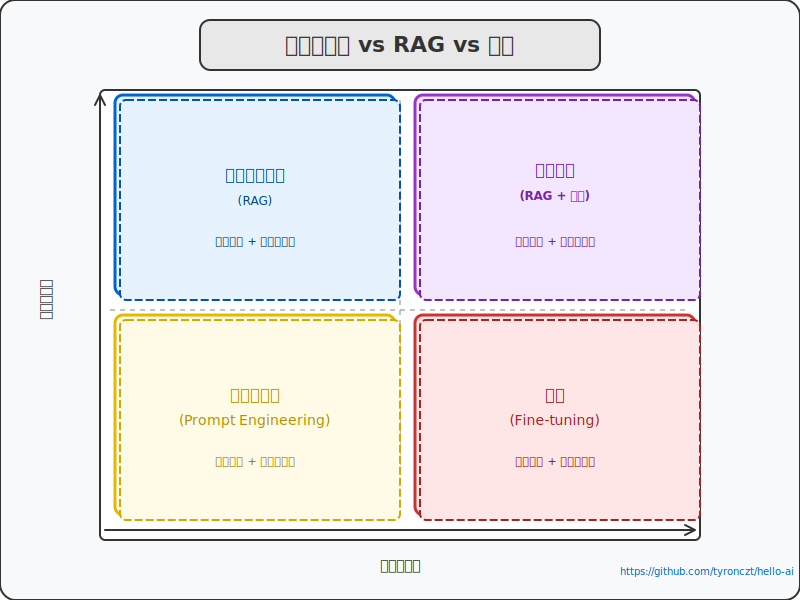

# 二、为什么要使用 RAG？

去年有个朋友联系我，说他们上线了一个 AI 客服，号称"接入了最先进的大语言模型"。结果上线第一周，售后部门就炸了——用户问的是"我的订单卡在发货三天了怎么办"，AI 洋洋洒洒写了一篇公司发展历程，就是不告诉他怎么查快递。

后来他们排查了一圈，发现问题根本不在模型，而在于那套检索逻辑太老——还是传统的关键词匹配。用户说的"卡在发货"，系统只认识"发货时效""配送政策"这些词，完全匹配不上。

然后他们上了 RAG。

三个月后我再问他，满意率从 32% 跳到了 71%。他说最重要的改变不是模型变聪明了，而是"AI 终于能看着正确的东西说话了"。

这个故事背后，是一个很多人在开始做大模型应用之前就想当然的问题：**大模型不是挺聪明的吗，为什么还要 RAG？**

## 大模型的问题，比你想的更多

不是要唱衰大模型，但它确实有几个绕不开的局限性，在某些场景下，这些局限性是致命的。

**第一个是知识有截止日期。**

你用 ChatGPT 的时候，不知道有没有注意到它从来不会主动告诉你"这条信息的截止时间是 XXX"。不是因为它不想说，而是它真的不知道。你的训练数据是什么时候的？2024 年？2023 年？一旦过了那个时间点，模型就像一本被锁住的书，之后发生的事情它一个字都看不到。

这个月在推特上刷屏的那个新产品，上个月刚发布的那份监管政策，昨天才披露的那份财报——模型通通不知道。你问它，它不会说"我不清楚"，它会开始一本正经地编。

这种编不是故意的，模型没有骗你的动机，它只是真的不知道自己不知道。这个特性在很多场景下是致命的，比如你拿它做金融分析、医疗建议、法律咨询，一分钱的误差都可能出问题。

**第二个是专业领域的深度不够。**

通用大模型的训练数据确实大，但"大"不等于"全"。很多垂直领域的知识，只存在于特定的文献、行业报告、内部文档里，公开互联网上找不到，自然也不会出现在模型的训练集里。

比如医疗场景下的临床指南、药品相互作用禁忌，法律场景下的判例解读、合同条款的行业惯例，工程场景下的内部接口文档、故障处理手册——这些东西，你让大模型凭空回答，它要么瞎编，要么给你一段正确的废话，读完不知道怎么执行。

我之前帮一个法务团队搭智能问答，他们的诉求很简单：让 AI 帮助律师快速检索相关判例和法规条文。结果测试了一圈下来，发现通用大模型最大的问题不是"答错了"，而是"答得太泛"——它能给出一个法律原则，但在具体到他们地区的司法实践、特殊判例这些细节上，完全没有深度。

**第三个是幻觉。**

这是大模型最让人头疼的地方。

什么叫幻觉？就是模型生成的内容看起来逻辑通顺、语法正确、用词专业，但实际上是错的。错的不是一两个字，是整个结论。

比如你问它" XX 法规是哪一年开始实施的"，它可能给你一个具体年份，你去查了一下发现根本没有这个法规。模型不是在骗你，它只是在你问的这个问题上"想象力过剩"，把几个相关的概念拼接出了一个看起来合理的答案，但这个答案跟现实没有任何关系。

这种感觉就像什么，就像你问一个销售"这个产品的主要竞争对手是谁"，他不假思索地报出了三个名字，其中两个根本不存在于这个市场里。你能怎么办？你只能去核实每一句话，但这样效率反而低了。

医疗和法律领域的从业者对这个问题的感受应该最深。美国有研究机构做过测试，让 AI 读检验报告辅助诊断，最后 AI 给出了看起来非常专业但完全错误的诊断建议，看得我后背发凉。在这种场景下，幻觉不只是一个技术问题，它可能出人命。

**第四个是数据隐私。**

你想让模型回答关于你公司内部数据的问题，但你又不想把这些数据上传到第三方 API——这两件事怎么同时满足？用通用大模型，几乎无解。

要么你把数据给它，隐私风险自己扛；要么你不用，模型回答的内容永远跟你真正的业务场景隔了一层。这是个没有标准答案的困境，但 RAG 提供了一条可行的路。

**第五个是可解释性。**

你问模型一个复杂问题，它给了一个答案。然后呢？你信还是不信？怎么核实？模型的决策过程是个黑箱，你只能选择相信或者不相信，没有中间地带。

但在实际业务里，"相信 AI"是不够的。你需要知道它为什么这么回答，是基于哪份文档，这个结论的可信度有多高。这些，闭着眼睛生成的模型给不了你。

## RAG 怎么解决这些问题？

说白了就一句话：**不是让模型靠记忆回答，而是让它先查资料，再回答。**

这就是 RAG 的核心思想——"开卷考试"而不是"闭卷考试"。

传统的大模型工作流程是这样的：

用户问题 → 大模型（靠记忆）→ 回答

模型回答的质量完全取决于它训练得好不好，以及你的 Prompt 写得好不好。它的知识边界就是它的能力边界，超出这个边界的东西，它要么不知道，要么开始编。

RAG 改变了这个流程：

用户问题 → 检索外部知识库 → 找出最相关的内容 → 大模型结合这些内容 → 回答

多了中间两步，但这两步带来了本质的变化——模型不再只靠记忆了，它有了一个可以随时查阅的外部知识库。

这意味着什么呢？

**知识时效性问题**，解决了。知识库是实时可以更新的，你今天上传了新文档，明天模型就能查到。不用重新训练，不用等模型更新，索引重建就行。

**专业领域深度问题**，解决了。你可以把领域相关的文档、指南、报告全部扔进知识库，让模型在回答时有据可查。你问医疗问题，它会先检索最新的临床指南；你问法律问题，它会先查相关的法规和判例；你问接口文档，它会直接读你们公司的技术文档。

**幻觉问题**，大幅缓解了。模型是"看着材料说话"的，不是凭空编的。它说的每句话，背后都有原始文档作为依据。当然，完全消除幻觉是不可能的，但至少错误的方向从"瞎编"变成了"引用错误"，这个问题好排查得多。

**数据隐私问题**，解决了。你的知识库可以部署在本地，不需要把数据上传到第三方 API。大模型只负责理解你检索出来的内容，不直接接触原始数据。

**可解释性问题**，解决了。RAG 的答案天然带着出处，用户可以点进去看原始文档。模型说"根据 XX 文档第 XX 页"，你可以直接去核实这个说法对不对。

当然，RAG 不是万能的，它解决不了所有问题。这个我后面会细说，先不跑题。

## 选型：Prompt、还是 RAG、还是微调？

这是很多人纠结的问题。

简单说，可以用三个递进的维度来判断。

**第一步，问自己这个问题靠 Prompt 能不能答好？**

如果模型本身的知识足够，比如"帮我写一封请假邮件""翻译一下这段英文"，这些任务不需要外部知识，那 Prompt Engineering 就够了。成本最低，上线最快，先从这个开始。

**第二步，如果模型的知识不够用，加 RAG。**

如果模型不知道你公司的内部制度、不了解你们产品的具体参数、不知道你们行业的最新动态，那把相关文档扔进知识库，用 RAG 来回答。模型的能力没有变，但它多了一个外脑可以查阅。这个阶段适合大多数企业级应用。

**第三步，如果模型的"行为方式"需要改变，用微调。**

RAG 和 Prompt 解决的是"模型知道什么"的问题，但有些场景需要改变的是"模型怎么回答"——它的语气、格式、遵循的指令方式。比如你希望 AI 的回复严格遵循你们品牌的表达风格，或者希望它在特定场景下遵守某些格式规范，这些靠 Prompt 很难做到，因为 Prompt 有长度限制，而且每次都要重复发送。

微调相当于把这些行为规范"烧进"模型的权重里，一次训练，长期生效。但代价是成本高、周期长，而且训练数据需要精心准备。微调适合的是"怎么做"而不是"知道什么"的问题，这个判断标准非常重要——方向不对，微调出来的模型就是浪费钱。

## 为什么有些公司宁愿用传统搜索，也不用 RAG？

这个问题的答案很现实：RAG 确实好，但它不是免费的午餐。

传统搜索的成本极低，一次搜索的延迟在毫秒级，成本几乎可以忽略不计。但 RAG 的完整链路要经过问题改写、向量化、向量检索、重排序、上下文组装、大模型生成——每一步都有延迟，每一步都有成本。尤其是大模型推理的部分，在高频调用场景下，成本会快速叠加。

传统搜索的答案是原文，用户自己判断相关性。可控性、可审计性非常强。RAG 的答案是模型生成的，可能有总结偏差，可能有引用错误，可能有幻觉。你需要额外的机制来保证质量：引用溯源、结果评测、幻觉检测。这些都需要工程投入。

还有数据治理的问题。传统搜索的权限控制相对成熟，ACL 加上字段过滤，基本能覆盖大多数场景。但 RAG 的权限控制需要在检索层、上下文组装层、日志层都做处理，比传统方案复杂不少。

所以为什么有些公司还在用传统搜索？因为对他们来说，传统方案够用了。他们需要的是找到文档、找到模板、找到制度原文，而不是让 AI 总结一段话。这种场景，关键词搜索比 RAG 更好使，成本更低，效果更稳定。

这不是 RAG 输了，是选型的问题。

我的建议是：先想清楚你的用户真正需要的是什么——是找到一份文档，还是得到一个可以直接用的答案？这个判断，决定了你应该选什么技术方案。

## 写在最后

RAG 不是银弹，它解决不了大模型的所有问题。但它解决的那几类问题——知识时效性、专业领域深度、幻觉、可解释性——恰好是企业在实际落地大模型应用时遇到最多的几个。

选什么技术，取决于你的问题是什么。

先把问题定义清楚，再去找解法。这件事说起来简单，但我在实际项目里见过太多人一上来就开始搭 RAG 系统，搭完了才发现——其实用 Prompt 就够了。

下一节我们来聊点更实在的：**怎么从零开始搭一个 RAG 系统**，有哪些坑需要提前避开。
