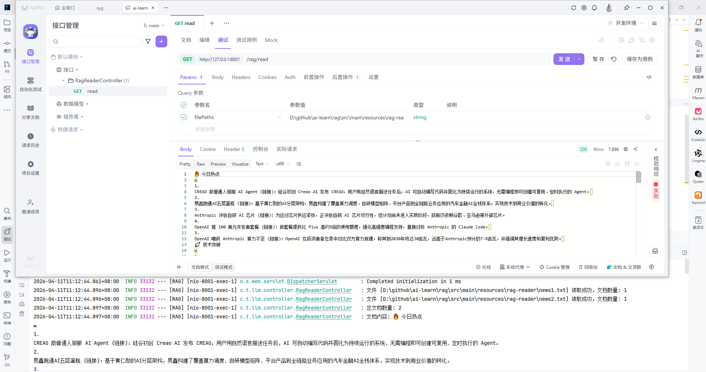
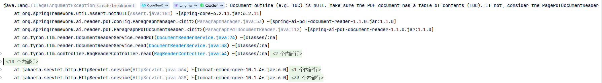
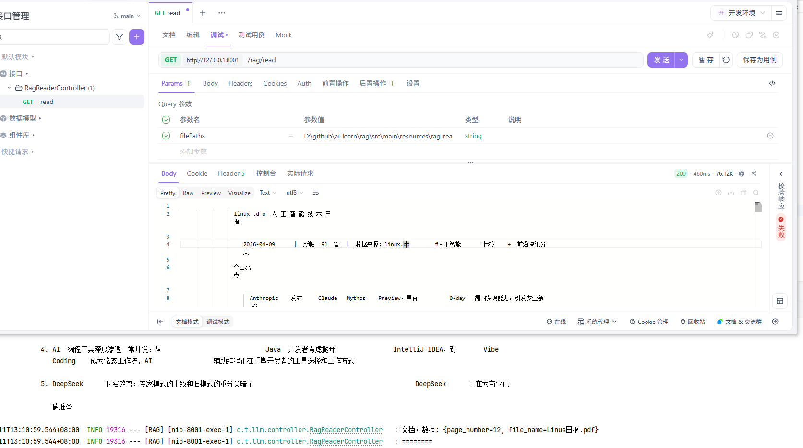
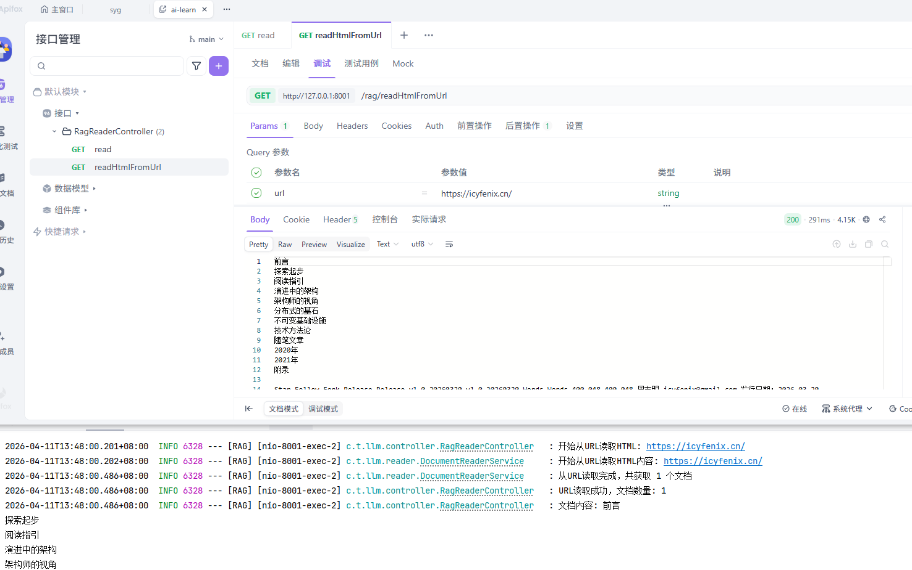
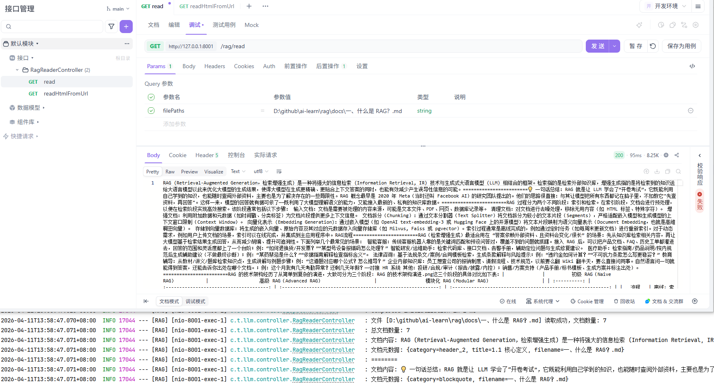
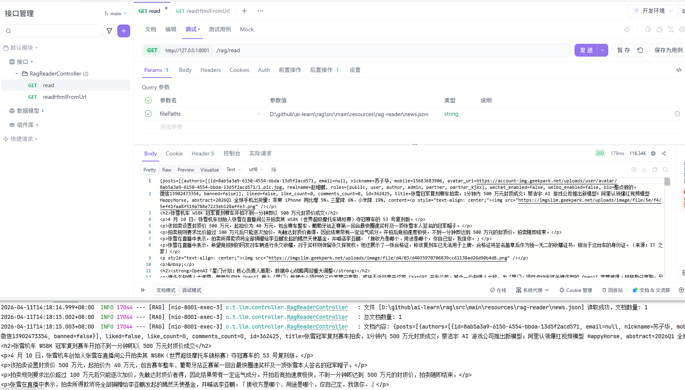
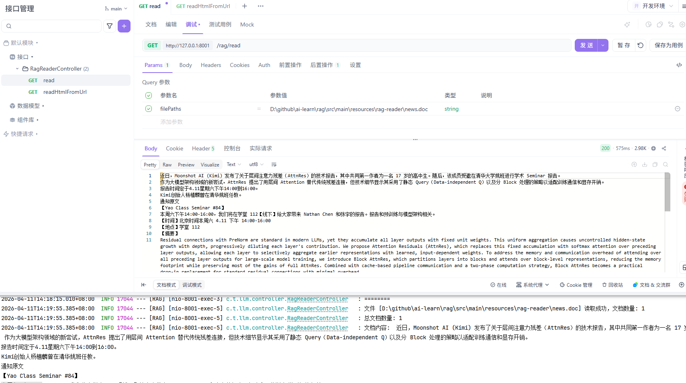
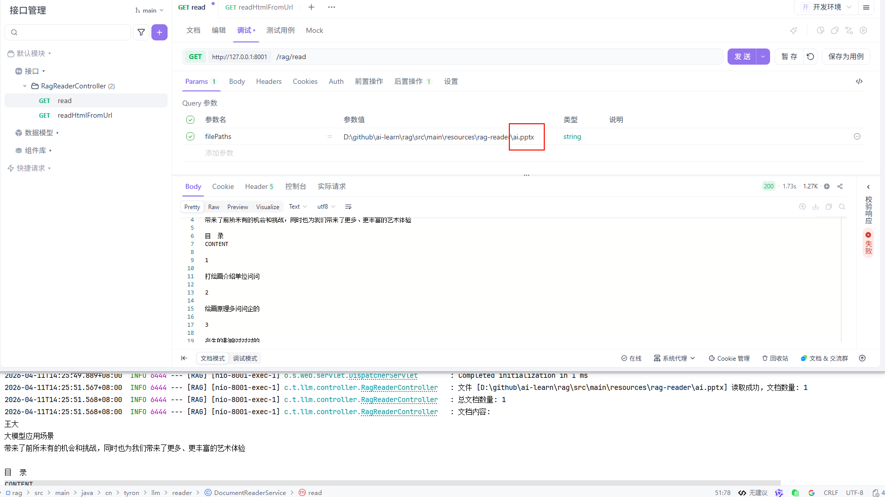
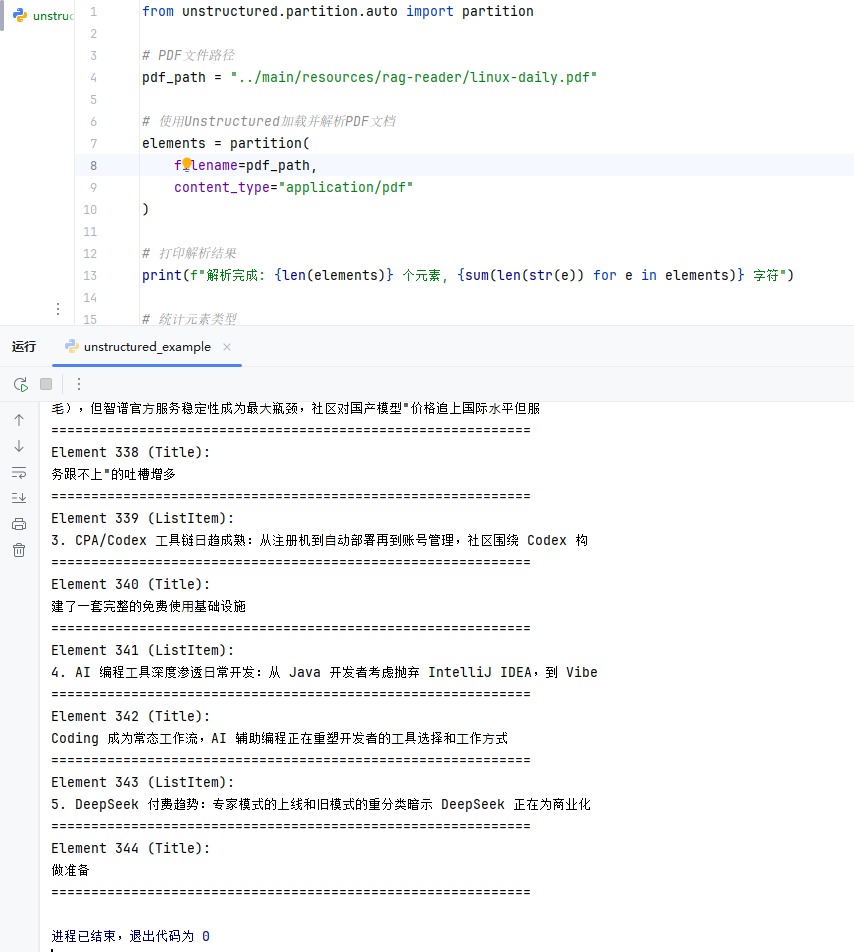

# 五、数据加载

虽然本节内容在实际应用中非常重要，但是由于各种文档加载器的迭代更新，以及各类 AI 应用的不同需求，具体选择需要根据实际情况。本节仅作简单引入，但请务必重视数据加载环节，“垃圾进，垃圾出 (Garbage In, Garbage Out)” ——高质量输入是高质量输出的前提。

## 1、文档加载器

### 1.1 主要功能

RAG 系统中，数据加载是整个流水线的第一步，也是不可或缺的一步。文档加载器负责将各种格式的非结构化文档（如PDF、Word、Markdown、HTML等）转换为程序可以处理的结构化数据。数据加载的质量会直接影响后续的索引构建、检索效果和最终的生成质量。

文档加载器在 RAG 的数据管道中一般需要完成三个核心任务，一是解析不同格式的原始文档，将 PDF、Word、Markdown 等内容提取为可处理的纯文本，二是在解析过程中同时抽取文档来源、页码、作者等关键信息作为元数据，三是把文本和元数据整理成统一的数据结构，方便后续进行切分、向量化和入库，其整体流程与传统数据工程中的抽取、转换、加载相似，目标都是把杂乱的原始文档清洗并对齐为适合检索和建模的标准化语料。

### 1.2 使用 SpringAI 文档读取

SpringAI 已经为我们提供了大量的读取器，拿来即用。这些读取器都来自 —— **DocumentReader**

在 Spring AI中，**DocumentReader** 是一个用于从各种格式的文档中提取文本内容并将其转换为 `Document` 对象的核心组件。这些 `Document` 对象随后可以被用于向量嵌入（embedding）、语义搜索、RAG（Retrieval-Augmented Generation）等 AI 应用场景，主要作用：

* **统一读取接口**：提供标准化方式从不同来源（如 PDF、Word、TXT、HTML、Markdown 等）加载原始文本。
* **结构化输出**：将原始内容封装为 `org.springframework.ai.document.Document` 对象，包含：
  * `content`：文档的文本内容
  * `metadata`：元数据（如文件名、页码、来源 URL、创建时间等）
* **支持扩展**：开发者可自定义实现特定格式的解析器。

#### 1.2.1 模块前置准备
添加依赖：
```xml
<dependency>
    <groupId>com.alibaba.cloud.ai</groupId>
    <artifactId>spring-ai-alibaba-starter-dashscope</artifactId>
    <version>1.1.0.0</version>
</dependency>
```
配置文件：
```yaml
spring:
  application:
    name: RAG
  ai:
    dashscope:
      api-key: dashscope.api.key
      embedding:
        options:
          model: text-embedding-v4
          dimensions: 768
```

#### 1.2.2 文本读取器
读取器是 Spring AI 中最常用的一种读取器，用于从文本文件中读取内容。
```java
public List<Document> read(File file) throws IOException {
    String fileName = file.getName().toLowerCase();
    Resource resource = new FileSystemResource(file);
    TextReader textReader = new TextReader(resource);
    return textReader.get();
}
```
执行结果：

> 由于初始文本格式错乱，导致读取结果中包含大量空行。PDF读取也会出现类似问题，后续统一文档清洗进行处理！
#### 1.2.3 PDF 读取器
引入依赖：
```xml
<dependency>
    <groupId>org.springframework.ai</groupId>
    <artifactId>spring-ai-pdf-document-reader</artifactId>
    <version>1.1.0</version>
</dependency>
```
这个包里面提供了两个reader：`ParagraphPdfDocumentReader`、`PagePdfDocumentReader`

区别是，`PagePdfDocumentReader` 是“按页切分”，而 `ParagraphPdfDocumentReader` 是“按语义段落切分”。

在 rag 中，如果你需要实现 PDF 读取策略，通常建议：

建议优先考虑使用 `ParagraphPdfDocumentReader`，因为它能够更好地保留信息的完整性。段落通常是一个完整的意思表达，这对于 LLM 理解上下文非常有帮助。但是他非常依赖PDF 本身的质量。如果 PDF 是扫描件或者没有良好的内部结构标记，它的效果可能不理想甚至回退到按行读取。

**代码执行**：

```java
 private List<Document> readPdf(Resource resource, File file) {
    // 创建PDF文档读取器配置对象，设置页面边距和每页文档数等参数
    PdfDocumentReaderConfig config = PdfDocumentReaderConfig.builder()
            .withPageTopMargin(50)        // 设置页面上边距为50
            .withPageBottomMargin(50)     // 设置页面下边距为50
            .withPagesPerDocument(1)      // 每个文档包含1页
            .withPageExtractedTextFormatter(new ExtractedTextFormatter.Builder()
                    .withNumberOfTopTextLinesToDelete(0)  // 设置不删除顶部文本行
                    .build())
            .build();

    // 使用配置创建段落PDF文档读取器实例，通过读取器读取PDF文件内容并返回文档列表
    ParagraphPdfDocumentReader pdfReader = new ParagraphPdfDocumentReader(resource, config);
    return pdfReader.read();
}
```
报错：

这个错误是因为 ParagraphPdfDocumentReader 要求 PDF 文件必须有目录(TOC),但当前处理的 PDF 文件没有。根据错误提示,应该使用 PagePdfDocumentReader 或 TikaDocumentReader 来代替。

调整代码后，重新读取：

```java
/**
 * 读取 PDF 文件
 * 该方法用于从给定的资源中读取PDF文件内容，并返回文档列表
 *
 * @param resource PDF文件资源对象，包含PDF文件的路径和其他相关信息
 * @param file PDF文件对象，表示要读取的本地文件
 * @return List<Document> 返回一个文档列表，每个文档代表PDF中的一页内容
 */
private List<Document> readPdf(Resource resource, File file) {
    // 创建PDF文档读取器配置对象，设置页面边距和每页文档数等参数
    PdfDocumentReaderConfig config = PdfDocumentReaderConfig.builder()
            .withPageTopMargin(50)        // 设置页面上边距为50
            .withPageBottomMargin(50)     // 设置页面下边距为50
            .withPagesPerDocument(1)      // 每个文档包含1页
            .withPageExtractedTextFormatter(new ExtractedTextFormatter.Builder()
                    .withNumberOfTopTextLinesToDelete(0)  // 设置不删除顶部文本行
                    .build())
            .build();

    try {
        // 优先尝试使用段落PDF文档读取器（需要PDF有目录结构）
        ParagraphPdfDocumentReader pdfReader = new ParagraphPdfDocumentReader(resource, config);
        return pdfReader.read();
    } catch (IllegalArgumentException e) {
        // 如果PDF没有目录结构，降级使用页面PDF文档读取器
        if (e.getMessage() != null && e.getMessage().contains("Document outline")) {
            log.warn("PDF文件 [{}] 没有目录结构，使用 PagePdfDocumentReader 读取", file.getName());
            PagePdfDocumentReader pagePdfReader = new PagePdfDocumentReader(resource, config);
            return pagePdfReader.read();
        }
        throw e;
    }
}
```


#### 1.2.4 HTML读取器
基于Jsoup HTML解析器，可以使用selector选择器指定提取网页标签内容。
引入依赖：
```xml
<dependency>
    <groupId>org.springframework.ai</groupId>
    <artifactId>spring-ai-jsoup-document-reader</artifactId>
    <version>1.1.0</version>
</dependency>
```
代码逻辑：
```java
/**
 * 根据网站地址读取 HTML 内容
 *
 * @param url 网站地址
 * @return 文档列表
 * @throws IOException IO异常
 */
public List<Document> readHtmlFromUrl(String url) throws IOException {
    log.info("开始从URL读取HTML内容: {}", url);

    // 创建URL资源
    Resource resource = new UrlResource(new URL(url));

    // 读取配置
    JsoupDocumentReaderConfig config = JsoupDocumentReaderConfig.builder()
            // 只提取p标签段落
            .selector("p")
            // 文件编码
            .charset("UTF-8")
            // 包含超链接
            .includeLinkUrls(true)
            // 提取meta标签的元数据
            .metadataTags(List.of("author", "date", "title", "description"))
            // 添加自定义元数据
            .additionalMetadata("source_url", url)
            .build();

    List<Document> documents = new JsoupDocumentReader(resource, config).get();
    log.info("从URL读取完成，共获取 {} 个文档", documents.size());

    return documents;
}
```
执行结果：

#### 1.2.5 Markdown读取器
引入依赖：
```xml
<dependency>
    <groupId>org.springframework.ai</groupId>
    <artifactId>spring-ai-markdown-document-reader</artifactId>
    <version>1.1.0</version>
</dependency>
```
代码逻辑：
```java
private List<Document> readMarkdown(Resource resource, File file) {
    // 读取配置
    MarkdownDocumentReaderConfig config = MarkdownDocumentReaderConfig.builder()
            // 水平线分割生成新文档
            .withHorizontalRuleCreateDocument(true)
            // 不包含代码块
            .withIncludeCodeBlock(false)
            // 不包含引用
            .withIncludeBlockquote(false)
            // 添加文件名元数据
            .withAdditionalMetadata("filename", file.getName())
            .build();
    return new MarkdownDocumentReader(resource, config).get();
}
```
执行结果：

#### 1.2.6 JSON读取器
引入依赖：
```xml
<dependency>
    <groupId>org.springframework.ai</groupId>
    <artifactId>spring-ai-json-document-reader</artifactId>
    <version>1.1.0</version>
</dependency>
```
代码逻辑：
```java
private List<Document> readJson(Resource resource, File file) {
    return new JsonDocumentReader(resource).get();
}
```
执行结果：

#### 1.2.7 通用Tika读取器
一种通用文件处理器，可以处理大部分常见文档格式，如word、pdf、ppt等等，可以自动识别文档类型并提取文本和元数据。  
引入依赖：
```xml
<dependency>
    <groupId>org.springframework.ai</groupId>
    <artifactId>spring-ai-tika-document-reader</artifactId>
    <version>1.1.0</version>
</dependency>
```
代码逻辑：
```java
private List<Document> readTika(Resource resource, File file) {
    return new TikaDocumentReader(resource).get();
}
```
执行结果：


### 1.3 文档清洗
在前面的步骤中，我们已成功实现文档读取功能。然而，读取结果往往包含大量无效干扰字符，因此需要进行数据清洗。数据清洗是对文本内容进行整理和优化的过程，包括去除多余空格、换行符、无意义的特殊符号和重复内容等。通过清洗，后续的文档分片和向量化操作可以在干净、一致的数据上进行，从源头提升知识库的质量与检索效果。为后续的文档分片、向量化以及检索生成等环节提供了更高质量的基础支撑。**实际项目中可以根据自己的文档数据、业务需求，定制化的开发清洗策略。**

## 2、Unstructured文档处理库
[Unstructured](https://unstructured.io/) 是一个专业的文档处理库，专门设计用于RAG和AI微调场景的非结构化数据预处理。提供了统一的接口来处理多种文档格式，是目前应用较广泛的文档加载解决方案之一。Unstructured 在格式支持和内容解析方面具有明显优势，它一方面支持 PDF、Word、Excel、HTML、Markdown 等多种文档格式，并通过统一的 API 接口避免为不同格式分别编写代码，另一方面可以自动识别标题、段落、表格、列表等文档结构，同时保留相应的元数据信息。

### 2.1 支持的文档元素类型

Unstructured 能够识别和分类以下文档元素 ：

|      元素类型       |                             描述                             |
| :-----------------: | :----------------------------------------------------------: |
|       `Title`       |                           文档标题                           |
|   `NarrativeText`   | 由多个完整句子组成的正文文本，不包括标题、页眉、页脚和说明文字 |
|     `ListItem`      |                列表项，属于列表的正文文本元素                |
|       `Table`       |                             表格                             |
|       `Image`       |                          图像元数据                          |
|      `Formula`      |                             公式                             |
|      `Address`      |                           物理地址                           |
|   `EmailAddress`    |                           邮箱地址                           |
|   `FigureCaption`   |                      图片标题/说明文字                       |
|      `Header`       |                           文档页眉                           |
|      `Footer`       |                           文档页脚                           |
|    `CodeSnippet`    |                           代码片段                           |
|     `PageBreak`     |                          页面分隔符                          |
|    `PageNumber`     |                             页码                             |
| `UncategorizedText` |                       未分类的自由文本                       |
| `CompositeElement`  |                   分块处理时产生的复合元素                   |

> `CompositeElement` 是通过分块处理产生的特殊元素类型，由一个或多个连续的文本元素组合而成。例如，多个列表项可能会被组合成一个单独的块。

**partition 函数参数解析：**

- `filename`: 文档文件路径，支持本地文件路径；
- `content_type`: 可选参数，指定MIME类型（如"application/pdf"），可绕过自动文件类型检测；
- `file`: 可选参数，文件对象，与 filename 二选一使用；
- `url`: 可选参数，远程文档 URL，支持直接处理网络文档；
- `include_page_breaks`: 布尔值，是否在输出中包含页面分隔符；
- `strategy`: 处理策略，可选 "auto"、"fast"、"hi_res" 等；
- `encoding`: 文本编码格式，默认自动检测。

`partition`函数使用自动文件类型检测，内部会根据文件类型路由到对应的专用函数（如PDF文件会调用`partition_pdf`）。如果需要更专业的PDF处理，可以直接使用`from unstructured.partition.pdf import partition_pdf`，它提供更多PDF特有的参数选项，如OCR语言设置、图像提取、表格结构推理等高级功能，同时性能更优。
执行结果：



> 在实际应用中，针对 pdf 的处理，目前更多选用的是 PaddleOCR、MinerU 等模型或工具。后续文章会有 MinerU 文档解析示例