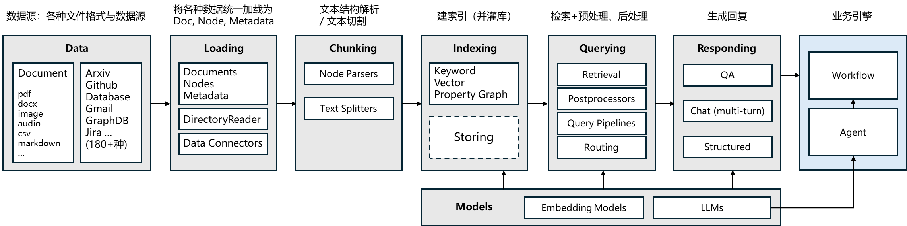
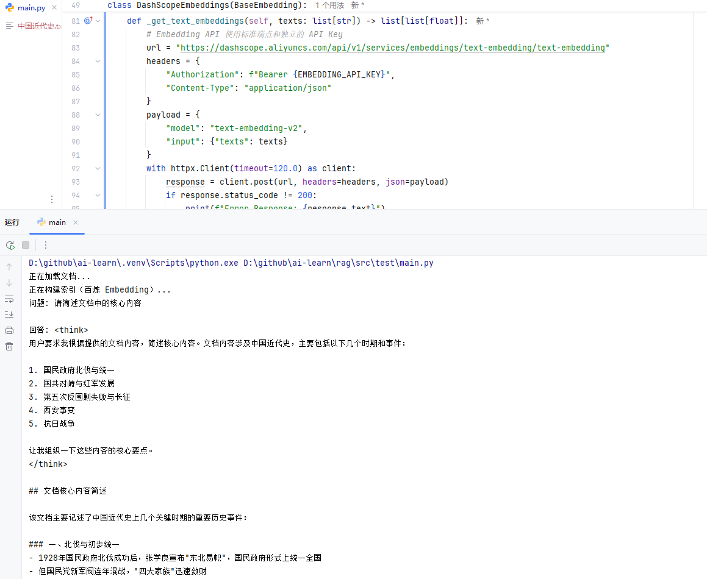

# 使用 LlamaIndex 构建一个简单的RAG系统
LlamaIndex是一个专为大语言模型设计的数据连接与检索框架，其核心目标是让 LLM 能够高效、准确地访问和利用私有或结构化/非结构化的外部数据。它在构建基于私有知识库的问答系统、智能客服、文档摘要、RAG（Retrieval-Augmented Generation）等应用中扮演关键角色。

## 主要功能
数据索引构建支持将各种格式的数据（如 PDF、Word、网页、数据库、API 等）转换为 LLM 可理解的索引结构（如向量索引、树状索引、关键词表等）。
高效检索提供多种查询引擎（如向量相似性搜索、混合检索、子问题分解等），从索引中快速找出与用户问题最相关的上下文。
与 LLM 无缝集成自动将检索到的上下文注入提示（prompt），供 LLM 生成准确、基于事实的回答。
支持多种数据源和格式内置对文件（PDF、TXT、DOCX）、数据库、Notion、Slack、Web 页面等的支持。
模块化与可扩展允许自定义文档加载器、文本分割器、嵌入模型、LLM 后端等组件。

## 主要作用？
解决 LLM 的“幻觉”问题：通过提供真实、相关的上下文，减少模型编造答案。
打通私有数据与通用 LLM：无需微调模型，即可让 LLM 回答企业内部文档中的问题。
简化 RAG 架构开发：封装了从数据加载 → 分块 → 嵌入 → 存储 → 检索 → 生成的完整流程。

## 为什么要用？
开箱即用：几行代码即可搭建一个基于私有文档的问答系统。
灵活性高：支持自定义嵌入模型（如 OpenAI、HuggingFace、本地模型）、LLM（如 GPT、Claude、Llama 3）等。
社区活跃、文档完善：由 LlamaIndex Inc. 维护，更新频繁，生态丰富。
与 LangChain 互补：LlamaIndex 更专注于数据索引与检索，而 LangChain 更侧重于Agent 和工作流编排，两者常结合使用。

## LlamaIndex使用
> 此处演示为Windows环境

### 初始化环境
1. Python 环境

   python 下载地址：https://www.python.org/downloads/
2. 导入依赖

   .venv\Scripts\python.exe -m pip install llama-index-core llama-index-embeddings-dashscope llama-index-llms-dashscope -i https://pypi.tuna.tsinghua.edu.cn/simple
3. 配置key

   此处使用minimax(付费大模型)+阿里百炼(用量收费-embedding)进行示例
   minimax的key地址：https://platform.minimaxi.com/user-center/payment/token-plan
   阿里百炼的key地址：https://bailian.console.aliyun.com/cn-beijing?tab=demohouse#/api-key

### 运行结果

> 代码地址：https://github.com/tyronczt/ai-learn/blob/main/rag/src/test/main.py

### （可选）免费模型使用-AIHubmix 
> 学习过程中发现的AIHubmix，使用参考：https://datawhalechina.github.io/all-in-rag/#/chapter1/02_preparation